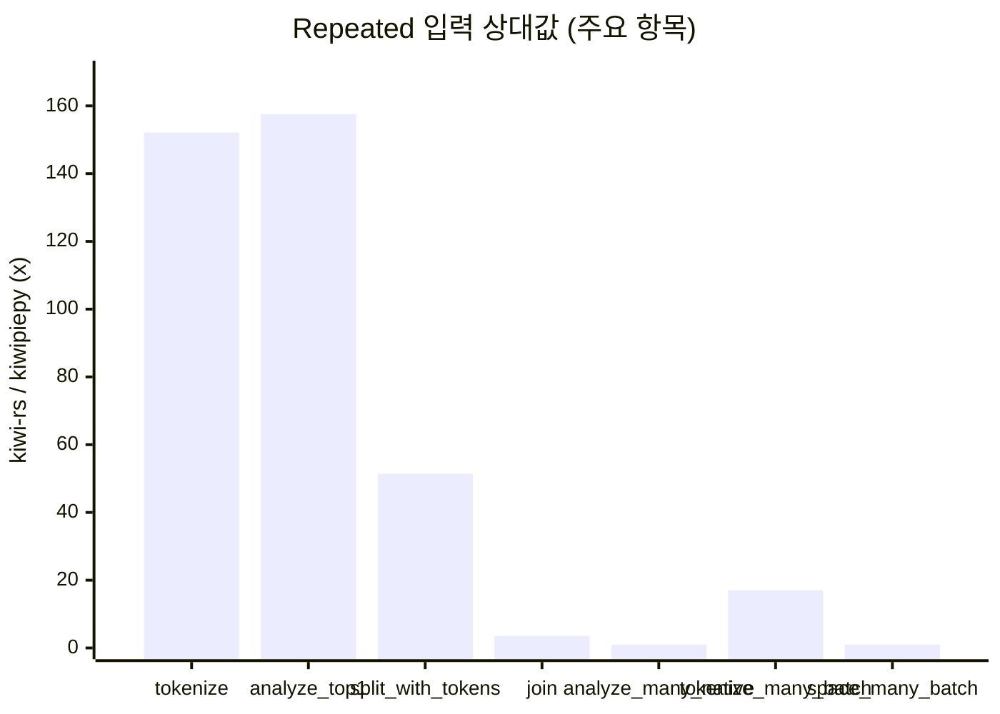
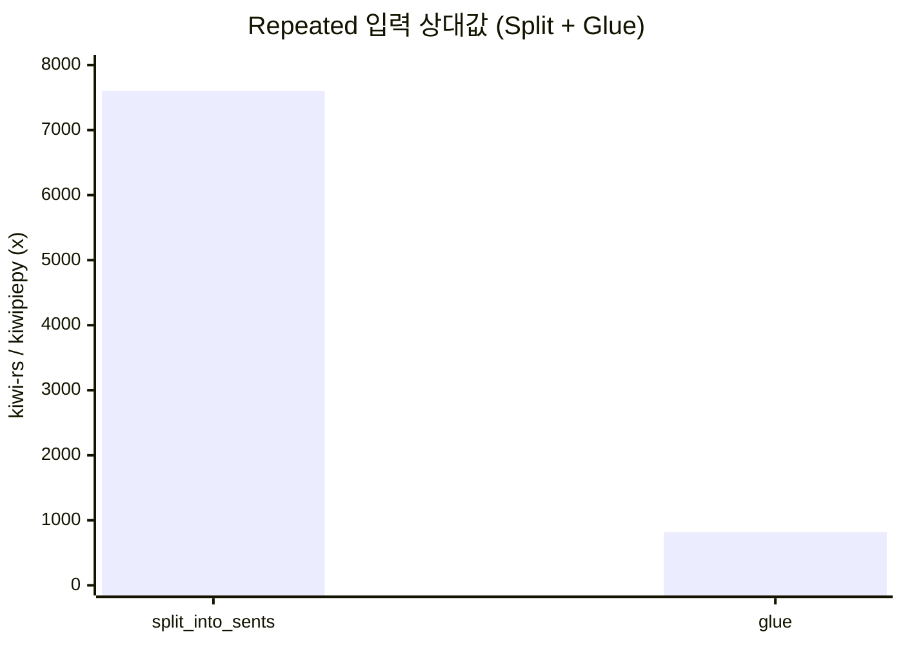
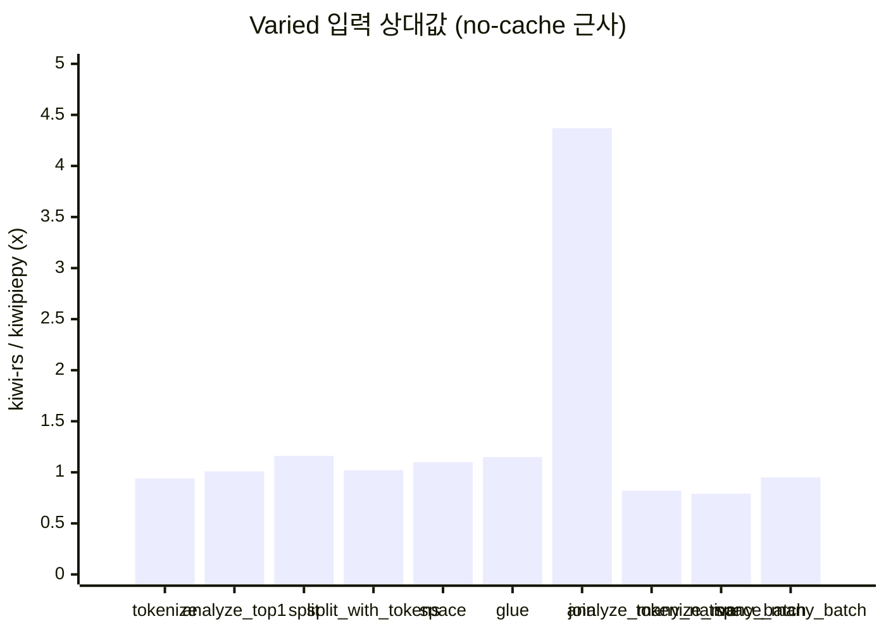
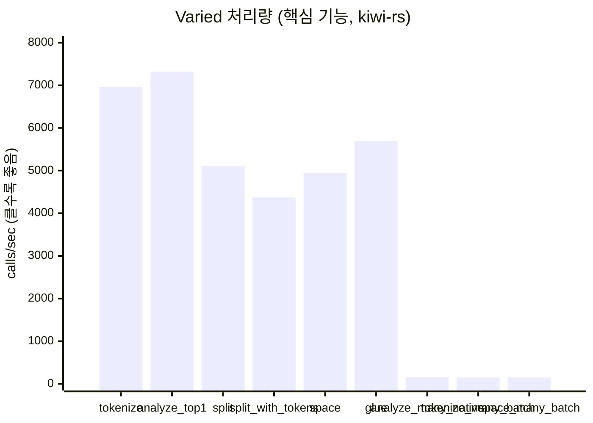
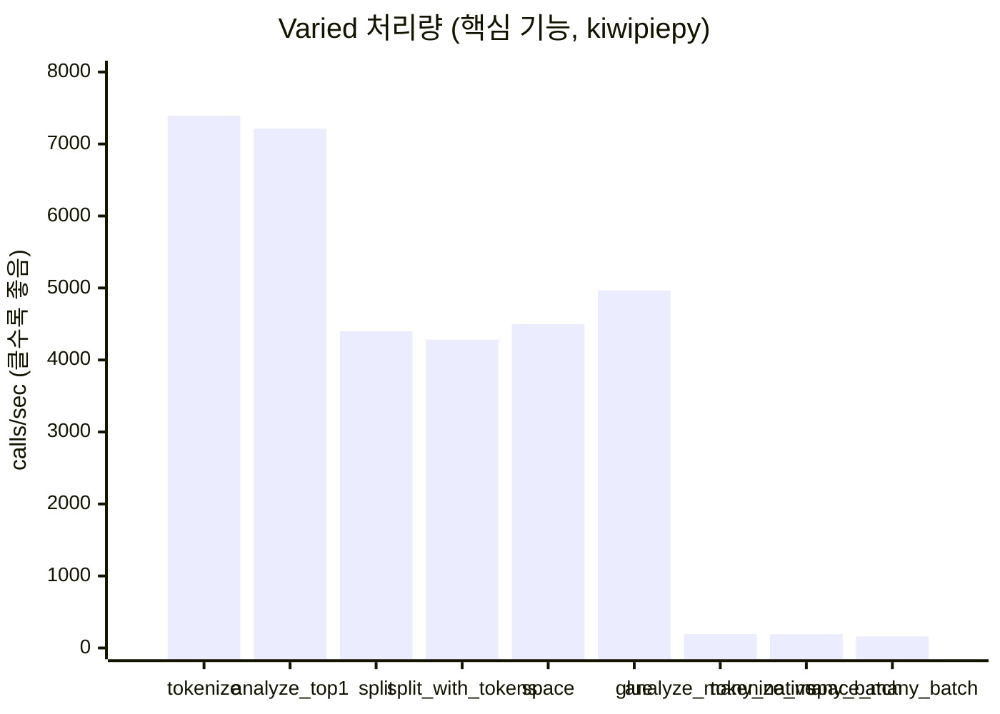
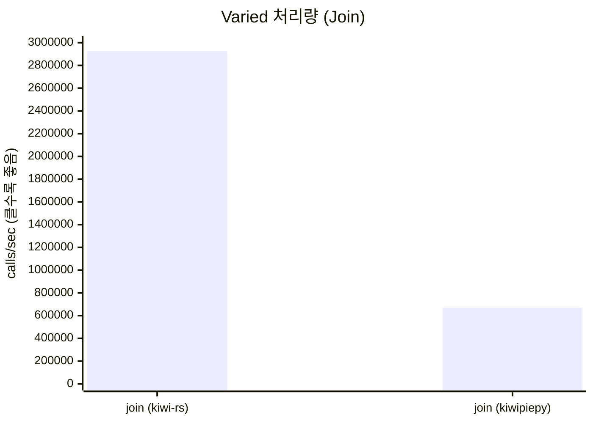
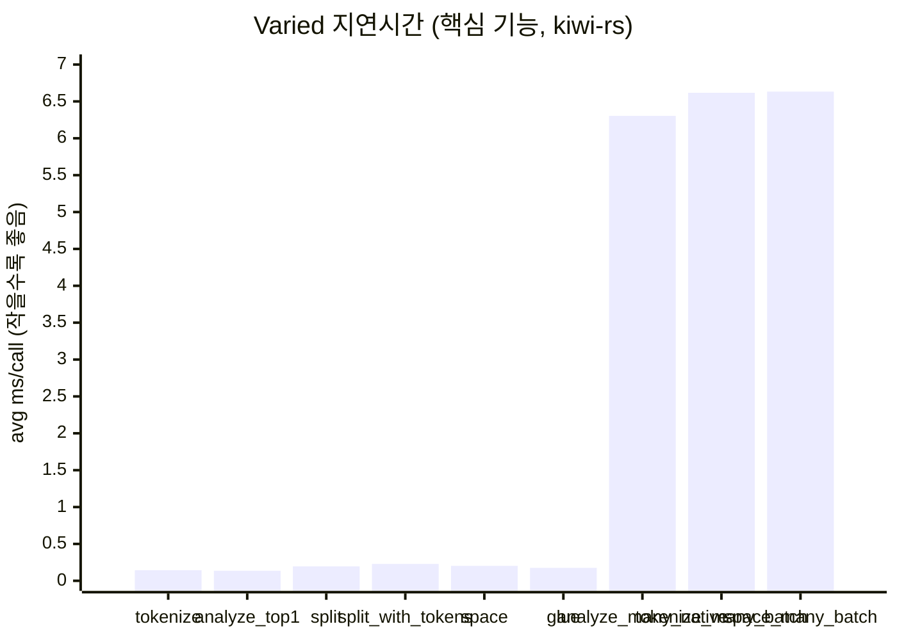
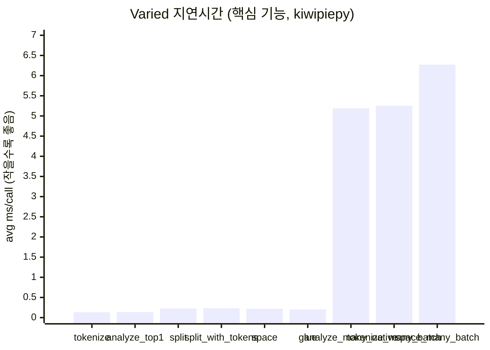

# kiwi-rs

[English README](README.md) | [kiwipiepy 호환성 문서(EN)](docs/kiwipiepy_parity.md) | [kiwipiepy 호환성 문서(KO)](docs/kiwipiepy_parity.ko.md)

`kiwi-rs`는 Kiwi 공식 C API(`include/kiwi/capi.h`)를 Rust에서 사용할 수 있게 만든 바인딩입니다.

## AI 활용 사용자 가이드

Codex/ChatGPT/Claude/Gemini 같은 AI로 `kiwi-rs` 코드를 만들 때는, 아래 계약을 포함해 요청하면 정확도가 올라갑니다.

1. 초기화 경로를 하나만 선택하게 하기 (`Kiwi::init`, `Kiwi::new`, `Kiwi::from_config`) + 선택 이유 명시.
2. 실행 가능한 Rust 코드로 답하게 하기 (`fn main() -> Result<(), Box<dyn std::error::Error>>`).
3. 검증 명령 1개 포함시키기 (`cargo run --example ...` 또는 `cargo run`).
4. 일반론 말고, 현재 요청에만 해당하는 주의점 2-3개 쓰게 하기.

프롬프트 템플릿:

```text
kiwi-rs로 아래 형식으로 답해줘.
1) 초기화 경로 선택과 이유
2) 복붙 실행 가능한 Rust 코드
3) 검증 명령 1개
4) 이 작업에만 해당하는 주의점
작업: <원하는 작업 설명>
환경: <OS / KIWI_LIBRARY_PATH, KIWI_MODEL_PATH 설정 여부>
```

AI에게 반드시 지키게 할 정확성 체크:

- UTF-8 오프셋을 바이트가 아니라 문자 인덱스로 다루기.
- UTF-16 API 사용 전 `supports_utf16_api()` 확인.
- `analyze_many_utf16_via_native` 사용 전 `supports_analyze_mw()` 확인.
- `kiwipiepy` 완전 호환으로 단정하지 않기 (`docs/kiwipiepy_parity.ko.md` 참고).

### Skill 기반 사용 (`skills/`)

이 저장소에는 `kiwi-rs` 전용 로컬 AI 스킬이 포함되어 있습니다.

- 스킬 본문: `skills/kiwi-rs-assistant/SKILL.md`
- 참조 문서: `skills/kiwi-rs-assistant/references/`
- 에이전트 메타데이터: `skills/kiwi-rs-assistant/agents/openai.yaml`

스킬 호출이 가능한 AI라면 아래처럼 명시적으로 호출하세요.

```text
$kiwi-rs-assistant를 사용해서 다음 작업을 구현해줘: <원하는 작업>
```

### `llms.txt` 사용

AI에 프롬프트를 보낼 때 `llms.txt`를 첫 컨텍스트 파일로 같이 주면, 문서 경로/핵심 API/예제/주의점 기준으로 답변 품질이 안정됩니다.

- 파일: `llms.txt`
- 권장 프롬프트 추가 문구:

```text
먼저 llms.txt를 읽고, 저장소의 실제 API와 예제 기준으로만 답해줘.
```

## 현재 지원 수준

2026-02-16 기준:

- C API 심볼 로딩: 완료 (`capi.h` 기준 `101/101`)
- 핵심 고수준 사용 흐름: 구현 완료 (`init/new/from_config`, `analyze/tokenize/split/join`, `MorphemeSet`, `Pretokenized`, 오타 API, `SwTokenizer`, CoNg API)
- `kiwipiepy` 표면 완전 호환: 부분 지원 (Python/C++ 전용 계층 일부 미구현)

## 설치

```toml
[dependencies]
kiwi-rs = "0.1"
```

## 런타임 준비 방식

### 방식 1: 코드에서 자동 준비 (`Kiwi::init`)

`Kiwi::init()`은 로컬 경로를 먼저 확인하고, 없으면 Kiwi release에서 라이브러리/모델을 자동 다운로드해 캐시에 저장합니다.

```rust
use kiwi_rs::Kiwi;

fn main() -> Result<(), Box<dyn std::error::Error>> {
    let kiwi = Kiwi::init()?;
    let tokens = kiwi.tokenize("아버지가방에들어가신다.")?;
    println!("{}", tokens.len());
    Ok(())
}
```

자동 준비 관련 환경변수:

- `KIWI_RS_VERSION` (기본: `latest`, 예: `v0.22.2`)
- `KIWI_RS_CACHE_DIR` (기본: OS 캐시 디렉터리)

자동 준비 시 필요한 외부 명령:

- 공통: `curl`, `tar`
- Windows zip 해제: `powershell` (`Expand-Archive`)

### 방식 2: 설치 스크립트 선실행

Linux/macOS:

```bash
cd kiwi-rs
make install-kiwi
```

Windows (PowerShell):

```powershell
cd kiwi-rs
powershell -NoProfile -ExecutionPolicy Bypass -File .\scripts\install_kiwi.ps1
```

설치 옵션:

- `KIWI_VERSION` / `-Version` (기본: `latest`)
- `KIWI_PREFIX` / `-Prefix` (기본: Unix `$HOME/.local/kiwi`, Windows `%LOCALAPPDATA%\\kiwi`)
- `KIWI_MODEL_VARIANT` / `-ModelVariant` (기본: `base`)

## 라이브러리/모델 경로 직접 지정

### 환경변수 기반 (`Kiwi::new`)

- `KIWI_LIBRARY_PATH`: 동적 라이브러리 경로
- `KIWI_MODEL_PATH`: 모델 디렉터리 경로

### 코드 기반 (`Kiwi::from_config`)

```rust
use kiwi_rs::{Kiwi, KiwiConfig};

fn main() -> Result<(), Box<dyn std::error::Error>> {
    let config = KiwiConfig::default()
        .with_library_path("/path/to/libkiwi.dylib")
        .with_model_path("/path/to/models/cong/base")
        .add_user_word("러스트", "NNP", 0.0);

    let kiwi = Kiwi::from_config(config)?;
    let analyses = kiwi.analyze_top_n("형태소 분석 예시", 2)?;
    println!("{} candidates", analyses.len());
    Ok(())
}
```

## API 개요

### 핵심 API

- 초기화: `Kiwi::init`, `Kiwi::new`, `Kiwi::from_config`, `Kiwi::init_direct`
- 분석/토크나이즈: `analyze*`, `tokenize*`, `analyze_many*`, `tokenize_many*`
- 문장 분리: `split_into_sents*`, `split_into_sents_with_options*`
- 결합/띄어쓰기: `join*`, `space*`, `glue*`

### 고급 API

- Builder: 사용자 단어/별칭 단어/기분석 단어/사용자 사전/정규식 규칙/단어 추출
- 제약 객체: `MorphemeSet`, `Pretokenized`
- 오타: `KiwiTypo`, 기본 오타셋, 비용 조정
- 서브워드: `SwTokenizer`
- CoNg: 유사도/문맥/예측/context-id 변환

### UTF-16 및 옵션 API 지원 여부 확인

- `Kiwi::supports_utf16_api`
- `Kiwi::supports_analyze_mw`
- `KiwiLibrary::supports_builder_init_stream`

## 예제 실행

```bash
cd kiwi-rs
cargo run --example basic
cargo run --example analyze_options
cargo run --example builder_custom_words
cargo run --example typo_build
cargo run --example blocklist_and_pretokenized
cargo run --example split_sentences
cargo run --example utf16_api
cargo run --example native_batch
cargo run --example sw_tokenizer -- /path/to/tokenizer.json
cargo run --example morpheme_semantics
cargo run --release --example bench_tokenize -- --iters 1000 --warmup 100
cargo run --release --example bench_features -- --iters 5000 --warmup 100 --batch-size 256 --batch-iters 500
```

각 예제가 확인하는 내용:

| 예제 | 확인 목적 | 핵심 API | 비고 |
|---|---|---|---|
| `basic` | 가장 기본적인 초기화 + 토크나이즈 흐름 | `Kiwi::init`, `Kiwi::tokenize` | 로컬 자산이 없을 때 캐시 기반 bootstrap 동작을 확인할 수 있습니다. |
| `analyze_options` | 분석 옵션이 후보 결과에 미치는 영향 | `AnalyzeOptions`, `Kiwi::analyze_with_options` | `top_n`, `match_options`, 후보 확률 출력 예시입니다. |
| `builder_custom_words` | 사용자 단어/규칙을 반영한 분석기 빌드 | `KiwiLibrary::builder`, `add_user_words`, `add_re_rule` | builder 단계 커스터마이징 API를 다룹니다. |
| `typo_build` | 오타 교정 기반 분석 활성화 | `default_typo_set`, `build_with_typo_and_default_options` | 토큰의 typo 관련 메타데이터를 출력합니다. |
| `blocklist_and_pretokenized` | 특정 형태소 차단 + 구간 강제 토큰화 | `new_morphset`, `new_pretokenized`, `tokenize_with_blocklist_and_pretokenized` | 도메인 제약/고정 구간 분석 시 유용합니다. |
| `split_sentences` | 문장 분리 + 문장별 토큰/하위문장 구조 확인 | `split_into_sents_with_options` | `Sentence` 구조(`text/start/end/tokens/subs`)를 확인합니다. |
| `utf16_api` | UTF-16 경로 분석/토크나이즈/문장분리 | `supports_utf16_api`, `analyze_utf16*`, `tokenize_utf16*`, `split_into_sents_utf16*` | 런타임 UTF-16 지원 여부 확인 로직 포함입니다. |
| `native_batch` | 네이티브 콜백 기반 배치 분석 경로 | `analyze_many_via_native`, `analyze_many_utf16_via_native` | 다중 문장 고처리량 시나리오에 맞는 예제입니다. |
| `sw_tokenizer` | 서브워드 토크나이저 인코딩/디코딩 | `open_sw_tokenizer`, `encode_with_offsets`, `decode` | `tokenizer.json` 경로 인자가 필요합니다. |
| `morpheme_semantics` | 형태소 ID 조회 + CoNg 의미 API 흐름 | `find_morphemes`, `morpheme`, `most_similar_morphemes`, `to_context_id` | 형태소/문맥 ID 기반 의미 API 사용법입니다. |
| `bench_tokenize` | 단계별 지연/처리량 공정 비교 | `Kiwi::init`, `Kiwi::tokenize` | `init`, 첫 호출, 반복 호출(steady-state) 지표를 분리 출력합니다. |
| `bench_features` | 확장 기능 처리량/지연 비교 (Rust 측) | `tokenize`, `analyze_with_options`, `split_into_sents*`, `space*`, `join*`, `glue`, `analyze_many*`, `tokenize_many` | `scripts/bench_features_kiwipiepy.py` 및 `scripts/compare_feature_bench.py`와 함께 실행해 Rust/Python 비교를 합니다. |

## Rust vs Python 벤치마크 (동일 조건)

Rust/Python 모두 동일한 텍스트, 워밍업, 반복 횟수로 측정하세요.

```bash
cd kiwi-rs
cargo run --release --example bench_tokenize -- --text "아버지가방에들어가신다." --warmup 100 --iters 5000
python3 scripts/bench_kiwipiepy.py --text "아버지가방에들어가신다." --warmup 100 --iters 5000
```

주의:

- steady-state 비교는 `bench_avg_ms`, `calls_per_sec`, `tokens_per_sec` 중심으로 보세요.
- 1회성 실행 체감은 `init_ms`, `first_tokenize_ms`를 별도로 보셔야 정확합니다.
- 엄밀한 1:1 비교를 원하면 두 런타임이 같은 자산(`KIWI_LIBRARY_PATH`, `KIWI_MODEL_PATH`)을 쓰도록 맞추세요.
- `kiwipiepy` 기본 `tokenize` 옵션과 맞추려면 Rust 벤치 명령에 `--python-default-options`를 붙이세요.

### 확장 기능 벤치마크 스냅샷 (로컬 측정, 2026-02-17)

실행 명령:

```bash
cd kiwi-rs
mkdir -p tmp
.venv-bench/bin/python scripts/compare_feature_bench.py \
  --text "아버지가방에들어가신다." \
  --warmup 100 --iters 5000 \
  --batch-size 256 --batch-iters 500 \
  --input-mode repeated --variant-pool 4096 \
  --repeats 1 \
  --md-out tmp/feature_bench_repeated.md \
  --json-out tmp/feature_bench_repeated.json

.venv-bench/bin/python scripts/compare_feature_bench.py \
  --text "아버지가방에들어가신다." \
  --warmup 100 --iters 5000 \
  --batch-size 256 --batch-iters 500 \
  --input-mode varied --variant-pool 8192 \
  --repeats 1 \
  --md-out tmp/feature_bench_varied.md \
  --json-out tmp/feature_bench_varied.json
```

동일 명령을 주기 실행하는 CI는 `.github/workflows/feature-benchmark.yml`에 설정되어 있습니다.
생성되는 markdown/json 스냅샷에는 벤치 환경/설정 메타데이터가 함께 포함됩니다.

아래 요약은 1회 실행 기준이며, 대괄호는 최소-최대 범위(1회 실행 시 동일값)입니다.

벤치 환경:

| 항목 | 값 |
|---|---|
| 측정 시각 (로컬) | 2026-02-17T17:10:06+09:00 |
| OS | Darwin 24.6.0 |
| 플랫폼 | macOS-15.7.4-arm64-arm-64bit-Mach-O |
| CPU | arm64 (샌드박스 제약으로 모델명 미확인) |
| 코어 (물리/논리) | -/10 |
| 메모리 | 16.00 GiB (17179869184 bytes) |
| rustc | rustc 1.93.1 (01f6ddf75 2026-02-11) |
| cargo | cargo 1.93.1 (083ac5135 2025-12-15) |
| Python (harness) | 3.14.3 (main, Feb 3 2026, 15:32:20) [Clang 17.0.0 (clang-1700.6.3.2)] |
| Python (bench bin) | Python 3.14.3 (`.venv-bench/bin/python`) |
| kiwipiepy | 0.22.2 |
| Git | `753b8dc4d648d33b5ed6f163ba2ae3cb46397a7e` (`main`, dirty=True) |

벤치 설정:

| 항목 | 값 |
|---|---|
| text | 아버지가방에들어가신다. |
| warmup | 100 |
| iters | 5000 |
| batch_size | 256 |
| batch_iters | 500 |
| input_mode | repeated |
| variant_pool | 4096 |
| repeats | 1 |
| join_lm_search | true |

처리량 비교 (`calls_per_sec`, 클수록 빠름):

| 기능 | `kiwi-rs` | `kiwipiepy` | 상대값 (`kiwi-rs / kiwipiepy`) |
|---|---:|---:|---:|
| `tokenize` | 1185489.51 [1185489.51-1185489.51] | 7792.55 [7792.55-7792.55] | 152.13x |
| `analyze_top1` | 1199112.66 [1199112.66-1199112.66] | 7612.25 [7612.25-7612.25] | 157.52x |
| `split_into_sents` | 28908752.41 [28908752.41-28908752.41] | 3802.38 [3802.38-3802.38] | 7602.80x |
| `split_into_sents_with_tokens` | 250558.01 [250558.01-250558.01] | 4872.41 [4872.41-4872.41] | 51.42x |
| `space` | 357757.20 [357757.20-357757.20] | 4768.69 [4768.69-4768.69] | 75.02x |
| `join` | 2402355.08 [2402355.08-2402355.08] | 675759.32 [675759.32-675759.32] | 3.56x |
| `glue` | 6221490.02 [6221490.02-6221490.02] | 7613.64 [7613.64-7613.64] | 817.15x |
| `analyze_many_loop` | 32.36 [32.36-32.36] | 27.94 [27.94-27.94] | 1.16x |
| `analyze_many_native` | 166.11 [166.11-166.11] | 165.71 [165.71-165.71] | 1.00x |
| `tokenize_many_loop` | 3409.24 [3409.24-3409.24] | 28.66 [28.66-28.66] | 118.95x |
| `tokenize_many_batch` | 3134.67 [3134.67-3134.67] | 184.16 [184.16-184.16] | 17.02x |
| `split_many_loop` | 27.87 [27.87-27.87] | 29.18 [29.18-29.18] | 0.96x |
| `space_many_loop` | 29.39 [29.39-29.39] | 27.22 [27.22-27.22] | 1.08x |
| `space_many_batch` | 161.79 [161.79-161.79] | 160.39 [160.39-160.39] | 1.01x |
| `batch_analyze_native` | 166.11 [166.11-166.11] | 165.71 [165.71-165.71] | 1.00x |

초기화 (`init_ms`, 작을수록 빠름):

| 초기화 경로 | `kiwi-rs` | `kiwipiepy` |
|---|---:|---:|
| `Kiwi::init()` / `Kiwi()` | 1417.905 [1417.905-1417.905] ms | 680.748 [680.748-680.748] ms |

Rust 전용 벤치 항목:

| 기능 | `kiwi-rs` |
|---|---:|
| `join_prepared` | 277556.12 [277556.12-277556.12] |
| `join_prepared_utf16` | 278618.79 [278618.79-278618.79] |
| `joiner_reuse` | 3518440.85 [3518440.85-3518440.85] |
| `joiner_reuse_utf16` | 2743359.29 [2743359.29-2743359.29] |

Python 전용 벤치 항목:

| 기능 | `kiwipiepy` |
|---|---:|
| `split_many_batch` | 181.50 [181.50-181.50] |

다양 입력(no-cache 근사) 시나리오 상대값 스냅샷 (`input_mode=varied`, `variant_pool=8192`):

| 기능 | Repeated 상대값 | Repeated 증감률 | Varied 상대값 | Varied 증감률 |
|---|---:|---:|---:|---:|
| `tokenize` | 152.13x | +15113.0% | 0.94x | -6.0% |
| `analyze_top1` | 157.52x | +15652.0% | 1.01x | +1.0% |
| `split_into_sents` | 7602.80x | +760180.0% | 1.16x | +16.0% |
| `split_into_sents_with_tokens` | 51.42x | +5042.0% | 1.02x | +2.0% |
| `glue` | 817.15x | +81615.0% | 1.15x | +15.0% |
| `analyze_many_native` | 1.00x | +0.0% | 0.82x | -18.0% |
| `tokenize_many_batch` | 17.02x | +1602.0% | 0.79x | -21.0% |
| `space_many_batch` | 1.01x | +1.0% | 0.95x | -5.0% |
| `join` | 3.56x | +256.0% | 4.37x | +337.0% |

`증감률(%)` 계산식: `(kiwi-rs / kiwipiepy - 1) * 100`  
`+`는 `kiwi-rs`가 더 빠름, `-`는 더 느림을 의미합니다.

시각화 바 차트(상대 처리량):







절대값 차트(다양 입력, no-cache 근사):

- 처리량(Throughput) = 1초당 처리 호출 수 (`calls/sec`, 클수록 좋음)
- 지연시간(Latency) = 호출 1건 평균 시간 (`avg_ms`, 작을수록 좋음)
- 일부 렌더러에서 `mermaid xychart-beta`의 다중 bar 시리즈가 겹쳐 보일 수 있습니다.
- 가독성을 위해 아래 차트는 엔진별로 분리했습니다.











해석:

- 반복적으로 동일한 형태소 시퀀스를 결합하는 경우, 기본 `join` 경로의 내부 LRU 캐시 효과로 `kiwi-rs`가 `join`에서도 우세하게 측정되었습니다.
- `split_into_sents`와 `glue`는 캐시 miss 경로/조각쌍 재사용 최적화 이후 `varied` 시나리오에서도 1.0x를 넘겼습니다.
- 고정된 시퀀스를 명시적으로 재사용할 때는 `prepare_joiner`(`joiner_reuse*`)가 여전히 가장 빠릅니다.
- 반복 입력에서는 내부 결과 캐시가 재사용되어 `tokenize*`, `analyze*`, 토큰 포함 문장 분리 경로 처리량이 크게 상승합니다.
- 공정성을 위해 `input_mode=repeated`(warm-cache)와 `input_mode=varied`(no-cache 근사) 결과를 함께 공개하는 것을 권장합니다.
- 이 벤치 구성에서는 `split_many_batch`가 Python 전용입니다.
- `Kiwi::init()`에는 자산 탐색/부트스트랩 체크가 포함되므로, 초기화와 steady-state 처리량은 분리해서 보시는 것이 정확합니다.

## kiwipiepy 호환성

상세 호환성 표:

- 영어: `docs/kiwipiepy_parity.md`
- 한국어: `docs/kiwipiepy_parity.ko.md`

요약하면, `kiwi-rs`는 C API로 가능한 핵심 워크플로는 대부분 지원하지만, Python/C++ 전용 계층(template/dataset/ngram 유틸)은 pure C API 바인딩 범위를 벗어납니다.

## 자주 발생하는 오류

- `failed to load library`
  - 라이브러리 경로가 잘못됐거나 접근 불가. `KIWI_LIBRARY_PATH`를 지정하거나 `Kiwi::init()` 사용.

- `Cannot open extract.mdl for WordDetector`
  - 모델 경로 오류. 모델 파일이 있는 디렉터리를 `KIWI_MODEL_PATH`(또는 config)로 지정.

- `reading type 'Ds' failed` 같은 iostream 계열 에러
  - 라이브러리/모델 버전 불일치 가능성이 높음. 같은 Kiwi release 태그의 자산으로 맞추기.

## 로컬 품질 검증

```bash
cd kiwi-rs
cargo fmt
cargo check
cargo test
cargo clippy --all-targets -- -D warnings
cargo check --examples
cargo package --allow-dirty
```

## 라이선스

Kiwi와 동일하게 LGPL v3를 따릅니다.
