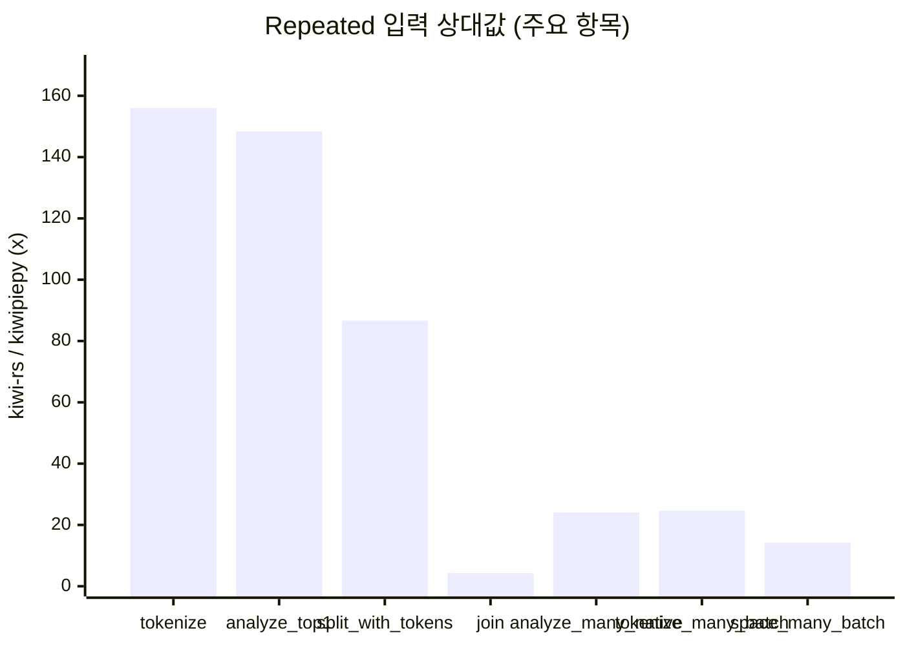
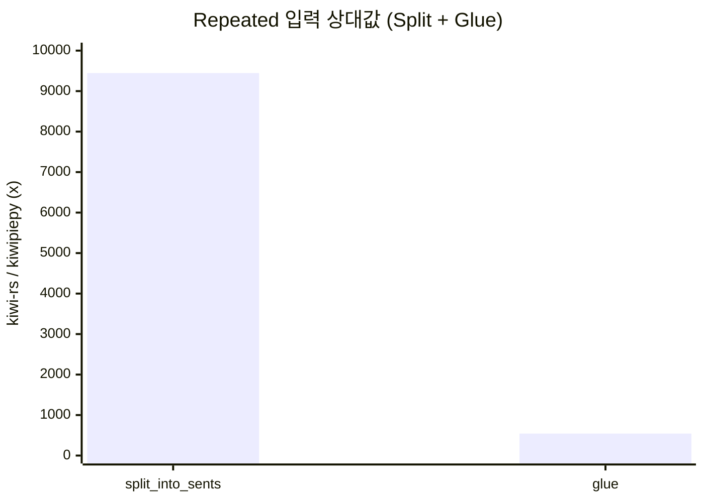
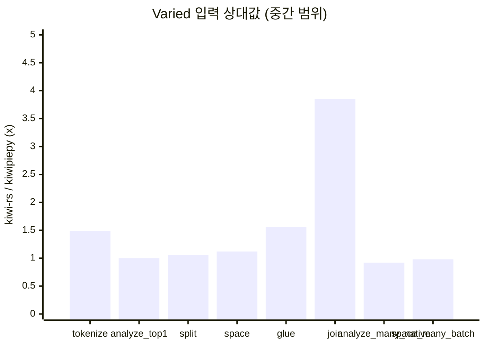
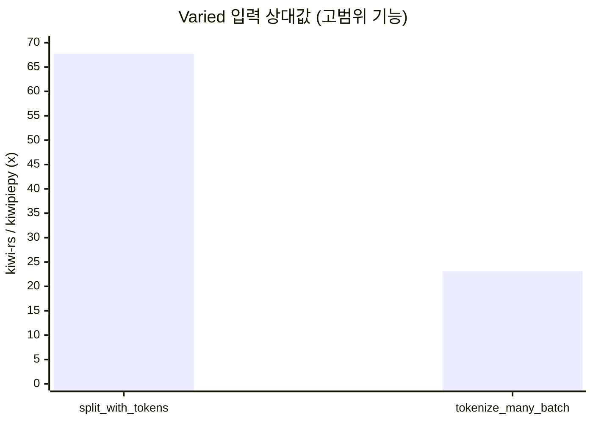

# kiwi-rs

[Technical Report (PDF)](report/technical_report.pdf) | [English README](README.md) | [kiwipiepy 호환성 문서(EN)](docs/kiwipiepy_parity.md) | [kiwipiepy 호환성 문서(KO)](docs/kiwipiepy_parity.ko.md)

`kiwi-rs`는 Kiwi 공식 C API(`include/kiwi/capi.h`)를 Rust에서 사용할 수 있게 만든 바인딩입니다.

## 목차

- [AI 활용 사용자 가이드](#ai-활용-사용자-가이드)
- [현재 지원 수준](#현재-지원-수준)
- [설치](#설치)
- [런타임 준비 방식](#런타임-준비-방식)
- [라이브러리/모델 경로 직접 지정](#라이브러리모델-경로-직접-지정)
- [API 개요](#api-개요)
- [예제 실행](#예제-실행)
- [Rust vs Python 벤치마크 (동일 조건)](#rust-vs-python-벤치마크-동일-조건)
- [kiwipiepy 호환성](#kiwipiepy-호환성)
- [자주 발생하는 오류](#자주-발생하는-오류)
- [로컬 품질 검증](#로컬-품질-검증)
- [라이선스](#라이선스)

## AI 활용 사용자 가이드

Codex/ChatGPT/Claude/Gemini 같은 AI로 `kiwi-rs` 코드를 만들 때는, 아래 계약을 포함해 요청하면 정확도가 올라갑니다.

1. 초기화 경로를 하나만 선택하게 하기 (`Kiwi::init`, `Kiwi::new`, `Kiwi::from_config`) + 선택 이유 명시.
2. 실행 가능한 Rust 코드로 답하게 하기 (`fn main() -> Result<(), Box<dyn std::error::Error>>`).
3. 검증 명령 1개 포함시키기 (`cargo run --example ...` 또는 `cargo run`).
4. 일반론 말고, 현재 요청에만 해당하는 주의점 2-3개 쓰게 하기.

프롬프트 템플릿:

```text
kiwi-rs로 아래 형식으로 답해줘.
1) 초기화 경로 선택과 이유
2) 복붙 실행 가능한 Rust 코드
3) 검증 명령 1개
4) 이 작업에만 해당하는 주의점
작업: <원하는 작업 설명>
환경: <OS / KIWI_LIBRARY_PATH, KIWI_MODEL_PATH 설정 여부>
```

AI에게 반드시 지키게 할 정확성 체크:

- UTF-8 오프셋을 바이트가 아니라 문자 인덱스로 다루기.
- UTF-16 API 사용 전 `supports_utf16_api()` 확인.
- `analyze_many_utf16_via_native` 사용 전 `supports_analyze_mw()` 확인.
- `kiwipiepy` 완전 호환으로 단정하지 않기 (`docs/kiwipiepy_parity.ko.md` 참고).

### Skill 기반 사용 (`skills/`)

이 저장소에는 `kiwi-rs` 전용 로컬 AI 스킬이 포함되어 있습니다.

- 스킬 본문: `skills/kiwi-rs-assistant/SKILL.md`
- 참조 문서: `skills/kiwi-rs-assistant/references/`
- 에이전트 메타데이터: `skills/kiwi-rs-assistant/agents/openai.yaml`

스킬 호출이 가능한 AI라면 아래처럼 명시적으로 호출하세요.

```text
$kiwi-rs-assistant를 사용해서 다음 작업을 구현해줘: <원하는 작업>
```

### `llms.txt` 사용

AI에 프롬프트를 보낼 때 `llms.txt`를 첫 컨텍스트 파일로 같이 주면, 문서 경로/핵심 API/예제/주의점 기준으로 답변 품질이 안정됩니다.

- 파일: `llms.txt`
- 권장 프롬프트 추가 문구:

```text
먼저 llms.txt를 읽고, 저장소의 실제 API와 예제 기준으로만 답해줘.
```

## 현재 지원 수준

2026-02-16 기준:

- C API 심볼 로딩: 완료 (`capi.h` 기준 `101/101`)
- 핵심 고수준 사용 흐름: 구현 완료 (`init/new/from_config`, `analyze/tokenize/split/join`, `MorphemeSet`, `Pretokenized`, 오타 API, `SwTokenizer`, CoNg API)
- `kiwipiepy` 표면 완전 호환: 부분 지원 (Python/C++ 전용 계층 일부 미구현)

## 설치

```toml
[dependencies]
kiwi-rs = "0.1"
```

## 런타임 준비 방식

### 방식 1: 코드에서 자동 준비 (`Kiwi::init`)

`Kiwi::init()`은 로컬 경로를 먼저 확인하고, 없으면 Kiwi release에서 라이브러리/모델을 자동 다운로드해 캐시에 저장합니다.

```rust
use kiwi_rs::Kiwi;

fn main() -> Result<(), Box<dyn std::error::Error>> {
    let kiwi = Kiwi::init()?;
    let tokens = kiwi.tokenize("아버지가방에들어가신다.")?;
    println!("{}", tokens.len());
    Ok(())
}
```

자동 준비 관련 환경변수:

- `KIWI_RS_VERSION` (기본: `latest`, 예: `v0.22.2`)
- `KIWI_RS_CACHE_DIR` (기본: OS 캐시 디렉터리)

자동 준비 시 필요한 외부 명령:

- 공통: `curl`, `tar`
- Windows zip 해제: `powershell` (`Expand-Archive`)

### 방식 2: 설치 스크립트 선실행

Linux/macOS:

```bash
cd kiwi-rs
make install-kiwi
```

Windows (PowerShell):

```powershell
cd kiwi-rs
powershell -NoProfile -ExecutionPolicy Bypass -File .\scripts\install_kiwi.ps1
```

설치 옵션:

- `KIWI_VERSION` / `-Version` (기본: `latest`)
- `KIWI_PREFIX` / `-Prefix` (기본: Unix `$HOME/.local/kiwi`, Windows `%LOCALAPPDATA%\\kiwi`)
- `KIWI_MODEL_VARIANT` / `-ModelVariant` (기본: `base`)

## 라이브러리/모델 경로 직접 지정

### 환경변수 기반 (`Kiwi::new`)

- `KIWI_LIBRARY_PATH`: 동적 라이브러리 경로
- `KIWI_MODEL_PATH`: 모델 디렉터리 경로

### 코드 기반 (`Kiwi::from_config`)

```rust
use kiwi_rs::{Kiwi, KiwiConfig};

fn main() -> Result<(), Box<dyn std::error::Error>> {
    let config = KiwiConfig::default()
        .with_library_path("/path/to/libkiwi.dylib")
        .with_model_path("/path/to/models/cong/base")
        .add_user_word("러스트", "NNP", 0.0);

    let kiwi = Kiwi::from_config(config)?;
    let analyses = kiwi.analyze_top_n("형태소 분석 예시", 2)?;
    println!("{} candidates", analyses.len());
    Ok(())
}
```

## API 개요

### 핵심 API

- 초기화: `Kiwi::init`, `Kiwi::new`, `Kiwi::from_config`, `Kiwi::init_direct`
- 분석/토크나이즈: `analyze*`, `tokenize*`, `analyze_many*`, `tokenize_many*`
- 문장 분리: `split_into_sents*`, `split_into_sents_with_options*`
- 결합/띄어쓰기: `join*`, `space*`, `glue*`

### 고급 API

- Builder: 사용자 단어/별칭 단어/기분석 단어/사용자 사전/정규식 규칙/단어 추출
- 제약 객체: `MorphemeSet`, `Pretokenized`
- 오타: `KiwiTypo`, 기본 오타셋, 비용 조정
- 서브워드: `SwTokenizer`
- CoNg: 유사도/문맥/예측/context-id 변환

### UTF-16 및 옵션 API 지원 여부 확인

- `Kiwi::supports_utf16_api`
- `Kiwi::supports_analyze_mw`
- `KiwiLibrary::supports_builder_init_stream`

## 예제 실행

```bash
cd kiwi-rs
cargo run --example basic
cargo run --example analyze_options
cargo run --example builder_custom_words
cargo run --example typo_build
cargo run --example blocklist_and_pretokenized
cargo run --example split_sentences
cargo run --example utf16_api
cargo run --example native_batch
cargo run --example sw_tokenizer -- /path/to/tokenizer.json
cargo run --example morpheme_semantics
cargo run --release --example bench_tokenize -- --iters 1000 --warmup 100
cargo run --release --example bench_features -- --iters 5000 --warmup 100 --batch-size 256 --batch-iters 500
```

각 예제가 확인하는 내용:

| 예제 | 확인 목적 | 핵심 API | 비고 |
|---|---|---|---|
| `basic` | 가장 기본적인 초기화 + 토크나이즈 흐름 | `Kiwi::init`, `Kiwi::tokenize` | 로컬 자산이 없을 때 캐시 기반 bootstrap 동작을 확인할 수 있습니다. |
| `analyze_options` | 분석 옵션이 후보 결과에 미치는 영향 | `AnalyzeOptions`, `Kiwi::analyze_with_options` | `top_n`, `match_options`, 후보 확률 출력 예시입니다. |
| `builder_custom_words` | 사용자 단어/규칙을 반영한 분석기 빌드 | `KiwiLibrary::builder`, `add_user_words`, `add_re_rule` | builder 단계 커스터마이징 API를 다룹니다. |
| `typo_build` | 오타 교정 기반 분석 활성화 | `default_typo_set`, `build_with_typo_and_default_options` | 토큰의 typo 관련 메타데이터를 출력합니다. |
| `blocklist_and_pretokenized` | 특정 형태소 차단 + 구간 강제 토큰화 | `new_morphset`, `new_pretokenized`, `tokenize_with_blocklist_and_pretokenized` | 도메인 제약/고정 구간 분석 시 유용합니다. |
| `split_sentences` | 문장 분리 + 문장별 토큰/하위문장 구조 확인 | `split_into_sents_with_options` | `Sentence` 구조(`text/start/end/tokens/subs`)를 확인합니다. |
| `utf16_api` | UTF-16 경로 분석/토크나이즈/문장분리 | `supports_utf16_api`, `analyze_utf16*`, `tokenize_utf16*`, `split_into_sents_utf16*` | 런타임 UTF-16 지원 여부 확인 로직 포함입니다. |
| `native_batch` | 네이티브 콜백 기반 배치 분석 경로 | `analyze_many_via_native`, `analyze_many_utf16_via_native` | 다중 문장 고처리량 시나리오에 맞는 예제입니다. |
| `sw_tokenizer` | 서브워드 토크나이저 인코딩/디코딩 | `open_sw_tokenizer`, `encode_with_offsets`, `decode` | `tokenizer.json` 경로 인자가 필요합니다. |
| `morpheme_semantics` | 형태소 ID 조회 + CoNg 의미 API 흐름 | `find_morphemes`, `morpheme`, `most_similar_morphemes`, `to_context_id` | 형태소/문맥 ID 기반 의미 API 사용법입니다. |
| `bench_tokenize` | 단계별 지연/처리량 공정 비교 | `Kiwi::init`, `Kiwi::tokenize` | `init`, 첫 호출, 반복 호출(steady-state) 지표를 분리 출력합니다. |
| `bench_features` | 확장 기능 처리량/지연 비교 (Rust 측) | `tokenize`, `analyze_with_options`, `split_into_sents*`, `space*`, `join*`, `glue`, `analyze_many*`, `tokenize_many` | `scripts/bench_features_kiwipiepy.py` 및 `scripts/compare_feature_bench.py`와 함께 실행해 Rust/Python 비교를 합니다. |

## Rust vs Python 벤치마크 (동일 조건)

Rust/Python 모두 동일한 텍스트, 워밍업, 반복 횟수로 측정하세요.

```bash
cd kiwi-rs
cargo run --release --example bench_tokenize -- --text "아버지가방에들어가신다." --warmup 100 --iters 5000
python3 scripts/bench_kiwipiepy.py --text "아버지가방에들어가신다." --warmup 100 --iters 5000
```

주의:

- steady-state 비교는 `bench_avg_ms`, `calls_per_sec`, `tokens_per_sec` 중심으로 보세요.
- 1회성 실행 체감은 `init_ms`, `first_tokenize_ms`를 별도로 보셔야 정확합니다.
- 엄밀한 1:1 비교를 원하면 두 런타임이 같은 자산(`KIWI_LIBRARY_PATH`, `KIWI_MODEL_PATH`)을 쓰도록 맞추세요.
- `kiwipiepy` 기본 `tokenize` 옵션과 맞추려면 Rust 벤치 명령에 `--python-default-options`를 붙이세요.

### 외부 공개용 벤치 실행 세트 (권장)

대외 문서/README에 성능 수치를 공개할 때는 아래 세트를 권장합니다.

```bash
cd kiwi-rs
mkdir -p tmp
.venv-bench/bin/python scripts/compare_feature_bench.py \
  --text "아버지가방에들어가신다." \
  --warmup 100 --iters 5000 \
  --batch-size 256 --batch-iters 500 \
  --input-mode repeated --variant-pool 4096 \
  --repeats 7 \
  --engine-order alternate \
  --sleep-between-engines-ms 200 \
  --sleep-between-runs-ms 500 \
  --sink-warning-threshold 0.05 \
  --bootstrap-samples 2000 \
  --equivalence-band 0.05 \
  --strict-sink-check \
  --md-out tmp/feature_bench_repeated_r7.md \
  --json-out tmp/feature_bench_repeated_r7.json

.venv-bench/bin/python scripts/compare_feature_bench.py \
  --text "아버지가방에들어가신다." \
  --warmup 100 --iters 5000 \
  --batch-size 256 --batch-iters 500 \
  --input-mode varied --variant-pool 8192 \
  --repeats 7 \
  --engine-order alternate \
  --sleep-between-engines-ms 200 \
  --sleep-between-runs-ms 500 \
  --sink-warning-threshold 0.05 \
  --bootstrap-samples 2000 \
  --equivalence-band 0.05 \
  --strict-sink-check \
  --md-out tmp/feature_bench_varied_r7.md \
  --json-out tmp/feature_bench_varied_r7.json
```

신뢰성 체크리스트:

- `input_mode=repeated`(warm-cache)와 `input_mode=varied`(no-cache 근사)를 함께 공개합니다.
- Rust는 반드시 release 모드로 측정하고, 메타데이터의 `rust_cmd`, `python_cmd`를 그대로 공개합니다.
- 자산 경로(`KIWI_LIBRARY_PATH`, `KIWI_MODEL_PATH`)를 양쪽 런타임에서 동일하게 맞추고 메타데이터에 남깁니다.
- 최소 `repeats>=5`(권장 `7`)로 측정하고 변동성(`CV`, `p95`, min-max)을 함께 공개합니다.
- 통계 방어력을 위해 상대 처리량의 `95% bootstrap CI`와 `P(ratio>1)`를 함께 공개합니다.
- 기능별 `sink` 비율(작업량 parity) 표를 확인하고, CI에서는 `--strict-sink-check` 사용을 권장합니다.
- Git SHA와 dirty 여부를 같이 공개해 재현 가능성을 보장합니다.

SWE 지표 해석 원칙(엄격 심사용):

- 승패 주장은 점 추정치가 아니라 CI 기준으로 제시합니다: `ratio [low, high]`.
- CI가 `1.05` 위에 완전히 위치할 때만(±5% practical equivalence 기준) Rust 우세를 강하게 주장합니다.
- CI가 `[0.95, 1.05]`를 가로지르면 승패를 강제하지 않고 동등/불확실로 분류합니다.
- startup(`init_ms`)은 steady-state 처리량 결론과 분리해 해석합니다.

데이터셋 기반 벤치(외부 심사 권장):

```bash
cd kiwi-rs
mkdir -p tmp
.venv-bench/bin/python scripts/compare_feature_bench.py \
  --dataset-tsv benchmarks/datasets/swe_textset_v2.tsv \
  --input-mode varied \
  --warmup 20 --iters 300 \
  --batch-size 128 --batch-iters 60 \
  --repeats 5 \
  --engine-order alternate \
  --sleep-between-engines-ms 100 \
  --sleep-between-runs-ms 200 \
  --sink-warning-threshold 0.05 \
  --bootstrap-samples 2000 \
  --equivalence-band 0.05 \
  --strict-sink-check \
  --md-out tmp/feature_bench_dataset_v2.md \
  --json-out tmp/feature_bench_dataset_v2.json

.venv-bench/bin/python scripts/compare_feature_dataset.py \
  --dataset-tsv benchmarks/datasets/swe_textset_v2.tsv \
  --input-mode varied \
  --warmup 20 --iters 300 \
  --batch-size 128 --batch-iters 60 \
  --repeats 5 \
  --out-dir tmp/feature_dataset_matrix_v2
```

데이터셋 참고 문서:

- 스펙: `docs/benchmark_dataset_spec.ko.md`
- 방어 가이드: `docs/benchmark_defense.ko.md`

### 확장 기능 벤치마크 스냅샷 (dataset v2, 다회 실행, 2026-02-17)

심사 방어 참고 문서:

- `docs/benchmark_defense.ko.md`
- `tmp/feature_dataset_matrix_v2_varied_r5_i300/matrix_summary.md`

이번 스냅샷 실행 명령:

```bash
cd kiwi-rs
mkdir -p tmp

# warm-cache 전체 비교 (repeated 입력)
.venv-bench/bin/python scripts/compare_feature_bench.py \
  --dataset-tsv benchmarks/datasets/swe_textset_v2.tsv \
  --input-mode repeated \
  --warmup 20 --iters 300 \
  --batch-size 128 --batch-iters 60 \
  --repeats 5 \
  --engine-order alternate \
  --sleep-between-engines-ms 100 \
  --sleep-between-runs-ms 200 \
  --bootstrap-samples 2000 \
  --equivalence-band 0.05 \
  --strict-sink-check \
  --md-out tmp/feature_dataset_matrix_v2_repeated_r5_i300/overall.md \
  --json-out tmp/feature_dataset_matrix_v2_repeated_r5_i300/overall.json

# no-cache 근사 데이터셋 계층 매트릭스
.venv-bench/bin/python scripts/compare_feature_dataset.py \
  --dataset-tsv benchmarks/datasets/swe_textset_v2.tsv \
  --input-mode varied \
  --warmup 20 --iters 300 \
  --batch-size 128 --batch-iters 60 \
  --repeats 5 \
  --bootstrap-samples 2000 \
  --equivalence-band 0.05 \
  --engine-order alternate \
  --sleep-between-engines-ms 100 \
  --sleep-between-runs-ms 200 \
  --out-dir tmp/feature_dataset_matrix_v2_varied_r5_i300
```

산출물:

- repeated overall: `tmp/feature_dataset_matrix_v2_repeated_r5_i300/overall.md`
- repeated overall json: `tmp/feature_dataset_matrix_v2_repeated_r5_i300/overall.json`
- varied overall: `tmp/feature_dataset_matrix_v2_varied_r5_i300/overall.md`
- varied overall json: `tmp/feature_dataset_matrix_v2_varied_r5_i300/overall.json`
- varied category matrix: `tmp/feature_dataset_matrix_v2_varied_r5_i300/matrix_summary.md`

벤치 환경:

| 항목 | 값 |
|---|---|
| 측정 시각 (로컬, varied overall) | 2026-02-17T20:27:29+09:00 |
| OS | Darwin 24.6.0 |
| 플랫폼 | macOS-15.7.4-arm64-arm-64bit-Mach-O |
| CPU | arm64 (샌드박스 제약으로 모델명 미확인) |
| 코어 (물리/논리) | -/10 |
| 메모리 | 16.00 GiB (17179869184 bytes) |
| rustc | rustc 1.93.1 (01f6ddf75 2026-02-11) |
| cargo | cargo 1.93.1 (083ac5135 2025-12-15) |
| Python (harness) | 3.14.3 (main, Feb 3 2026, 15:32:20) [Clang 17.0.0 (clang-1700.6.3.2)] |
| Python (bench bin) | Python 3.14.3 (`.venv-bench/bin/python`) |
| kiwipiepy | 0.22.2 |
| Git | `cfd859461801659e6dcc099f57ff23001e8934b8` (`main`, dirty=True) |

데이터셋 프로필:

| 항목 | 값 |
|---|---|
| 경로 | `benchmarks/datasets/swe_textset_v2.tsv` |
| sha256 | `8c81b8e8d0c4272f96c05e6851da10759f02361caa0a2acb881dd72e642f4696` |
| 행 수 | 192 |
| 고유 문장 수 | 192 |
| 카테고리 수 | 8 |
| 카테고리 분포 | code_mixed:24, colloquial:24, ecommerce:24, finance:24, longform:24, news:24, tech:24, typo_noisy:24 |
| 텍스트 길이(문자) | min=14, median=63, max=192 |

벤치 설정:

| 프로필 | input_mode | warmup | iters | batch_size | batch_iters | repeats | bootstrap_samples | equivalence_band | engine_order |
|---|---|---:|---:|---:|---:|---:|---:|---:|---|
| repeated overall | repeated | 20 | 300 | 128 | 60 | 5 | 2000 | ±5% | alternate |
| varied matrix | varied | 20 | 300 | 128 | 60 | 5 | 2000 | ±5% | alternate |

카테고리 요약 (varied, 카테고리별):

| 카테고리 | 중앙값 비율 | Rust 승/전체 | 최약 기능 | 최강 기능 |
|---|---:|---:|---|---|
| `code_mixed` | 40.23x | 15/15 | `join` (4.29x) | `split_many_loop` (3961.64x) |
| `colloquial` | 53.59x | 15/15 | `join` (3.98x) | `split_many_loop` (4633.05x) |
| `ecommerce` | 53.79x | 15/15 | `join` (4.27x) | `split_many_loop` (6435.18x) |
| `finance` | 49.18x | 15/15 | `join` (3.62x) | `split_many_loop` (7399.29x) |
| `longform` | 56.26x | 15/15 | `join` (4.70x) | `split_many_loop` (18218.50x) |
| `news` | 53.04x | 15/15 | `join` (3.66x) | `split_many_loop` (7721.17x) |
| `tech` | 43.72x | 15/15 | `join` (3.12x) | `split_many_loop` (6182.83x) |
| `typo_noisy` | 70.02x | 15/15 | `join` (3.97x) | `split_many_loop` (4048.25x) |

Repeated vs Varied 상대값 스냅샷 (`kiwi-rs / kiwipiepy`):

| 기능 | Repeated 상대값 | Repeated 증감률 | Varied 상대값 | Varied 증감률 |
|---|---:|---:|---:|---:|
| `tokenize` | 156.03x | +15503.4% | 1.49x | +48.9% |
| `analyze_top1` | 148.44x | +14744.4% | 1.00x | +0.3% |
| `split_into_sents` | 9445.91x | +944491.2% | 1.06x | +6.4% |
| `split_into_sents_with_tokens` | 86.64x | +8564.1% | 67.75x | +6675.4% |
| `space` | 99.02x | +9802.0% | 1.12x | +11.8% |
| `glue` | 542.54x | +54153.8% | 1.56x | +56.2% |
| `join` | 4.30x | +329.9% | 3.85x | +285.1% |
| `analyze_many_native` | 24.10x | +2309.9% | 0.92x | -7.9% |
| `tokenize_many_batch` | 24.62x | +2362.2% | 23.18x | +2217.9% |
| `space_many_batch` | 14.23x | +1322.6% | 0.98x | -1.7% |

`증감률(%)` 계산식: `(kiwi-rs / kiwipiepy - 1) * 100`  
`+`는 `kiwi-rs`가 더 빠름, `-`는 더 느림을 의미합니다.

시각화 바 차트(상대 처리량):









처리량(Throughput) = 1초당 처리 호출 수 (`calls/sec`, 클수록 좋음).
지연시간(Latency) = 호출 1건 평균 시간 (`avg_ms`, 작을수록 좋음).

좌우 숫자 비교 테이블(다양 입력, no-cache 근사):

| 기능 | `kiwi-rs` calls/sec | `kiwipiepy` calls/sec | 상대값 (`x`) | 증감률 | `kiwi-rs` avg_ms | `kiwipiepy` avg_ms |
|---|---:|---:|---:|---:|---:|---:|
| `tokenize` | 3052.78 | 2049.71 | 1.49x | +48.9% | 0.327571 | 0.487874 |
| `analyze_top1` | 2098.51 | 2092.15 | 1.00x | +0.3% | 0.476528 | 0.477976 |
| `split_into_sents` | 2116.51 | 1990.01 | 1.06x | +6.4% | 0.472477 | 0.502509 |
| `split_into_sents_with_tokens` | 137646.25 | 2031.56 | 67.75x | +6675.4% | 0.007265 | 0.492232 |
| `space` | 2420.12 | 2164.93 | 1.12x | +11.8% | 0.413203 | 0.461909 |
| `glue` | 2860.79 | 1831.72 | 1.56x | +56.2% | 0.349553 | 0.545935 |
| `join` | 1413427.56 | 367047.46 | 3.85x | +285.1% | 0.000708 | 0.002724 |
| `analyze_many_native` | 86.50 | 93.90 | 0.92x | -7.9% | 11.561290 | 10.650051 |
| `tokenize_many_batch` | 2259.52 | 97.48 | 23.18x | +2217.9% | 0.442572 | 10.258036 |
| `space_many_batch` | 92.02 | 93.64 | 0.98x | -1.7% | 10.867520 | 10.678922 |

초기화 (`init_ms`, 작을수록 빠름):

| 프로필 | `kiwi-rs` | `kiwipiepy` |
|---|---:|---:|
| repeated overall | 1316.395 ms | 631.000 ms |
| varied overall | 1326.721 ms | 622.918 ms |

해석:

- 반복 동일 입력은 warm-cache 상한선이며 대부분 기능에서 큰 폭의 속도 우위를 보입니다.
- 외부 공개 기준은 `varied` 데이터셋 프로필(no-cache 근사)입니다.
- `varied`에서 `analyze_many_native`, `space_many_batch`는 거의 동급이거나 Python이 근소 우세할 수 있습니다.
- `join`은 두 프로필 모두에서 일관되게 Rust가 빠르게 측정됩니다.
- 카테고리 분해 결과(`varied`)에서 공통 기능 기준으로 모든 카테고리에서 Rust가 승리(`15/15`)했습니다.
- 초기화(`init_ms`)는 steady-state 처리량과 분리해 해석해야 합니다.

## kiwipiepy 호환성

상세 호환성 표:

- 영어: `docs/kiwipiepy_parity.md`
- 한국어: `docs/kiwipiepy_parity.ko.md`

요약하면, `kiwi-rs`는 C API로 가능한 핵심 워크플로는 대부분 지원하지만, Python/C++ 전용 계층(template/dataset/ngram 유틸)은 pure C API 바인딩 범위를 벗어납니다.

## 자주 발생하는 오류

- `failed to load library`
  - 라이브러리 경로가 잘못됐거나 접근 불가. `KIWI_LIBRARY_PATH`를 지정하거나 `Kiwi::init()` 사용.

- `Cannot open extract.mdl for WordDetector`
  - 모델 경로 오류. 모델 파일이 있는 디렉터리를 `KIWI_MODEL_PATH`(또는 config)로 지정.

- `reading type 'Ds' failed` 같은 iostream 계열 에러
  - 라이브러리/모델 버전 불일치 가능성이 높음. 같은 Kiwi release 태그의 자산으로 맞추기.

## 로컬 품질 검증

```bash
cd kiwi-rs
cargo fmt
cargo check
cargo test
cargo clippy --all-targets -- -D warnings
cargo check --examples
cargo package --allow-dirty
```

## 라이선스

- `kiwi-rs`는 **LGPL-2.1-or-later** 라이선스를 따릅니다.
- 이 프로젝트가 사용하는 상위 Kiwi C 라이브러리는 LGPL 2.1 조건으로 배포됩니다.
- 전체 라이선스 본문은 [`LICENSE`](LICENSE)를 참고하세요.
