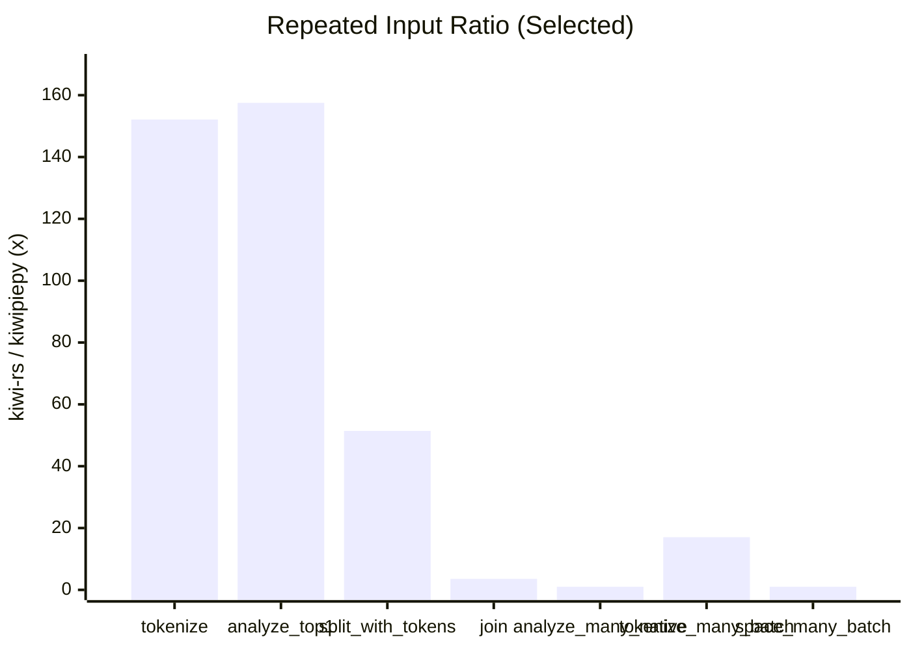
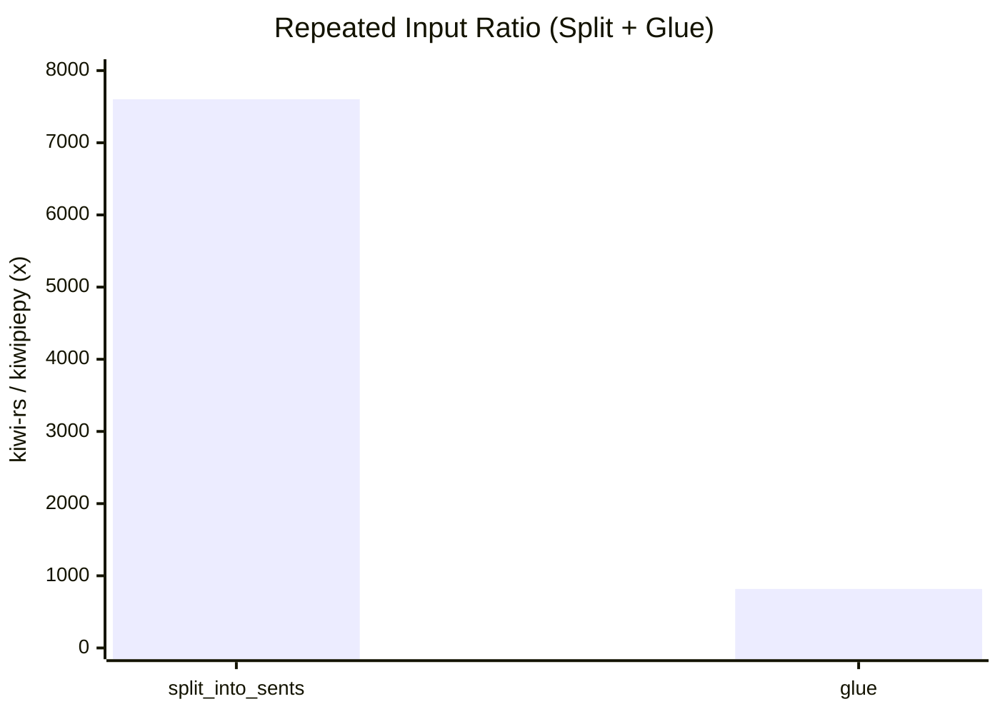
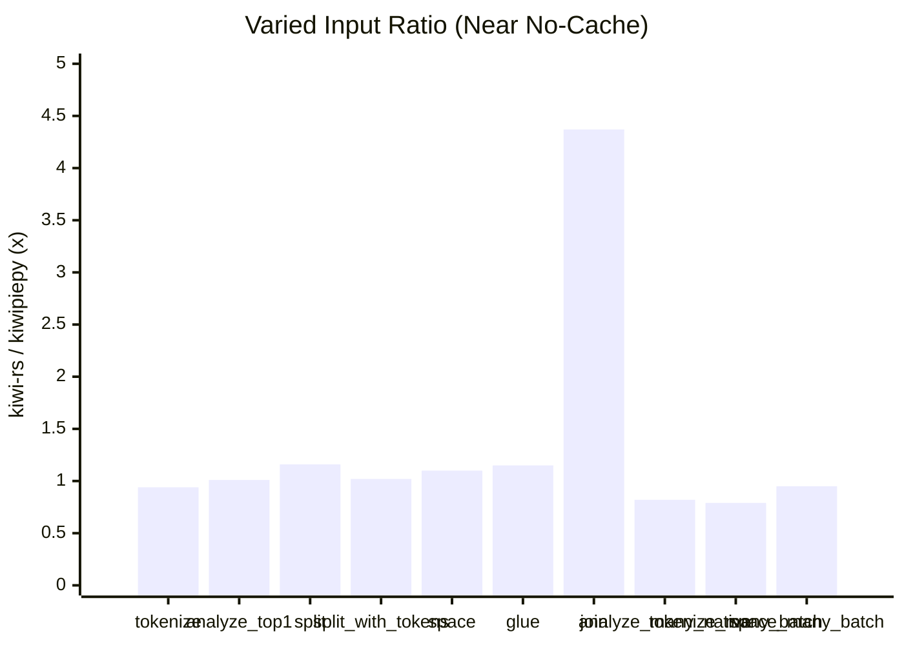
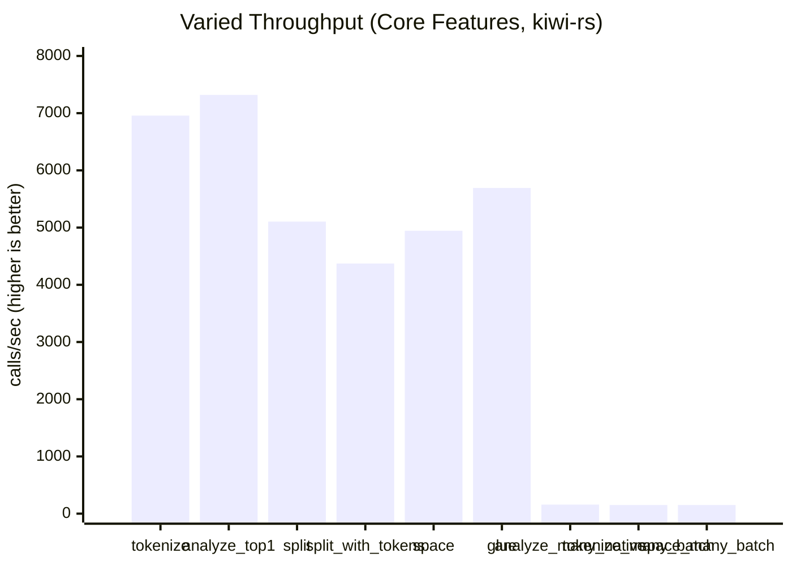
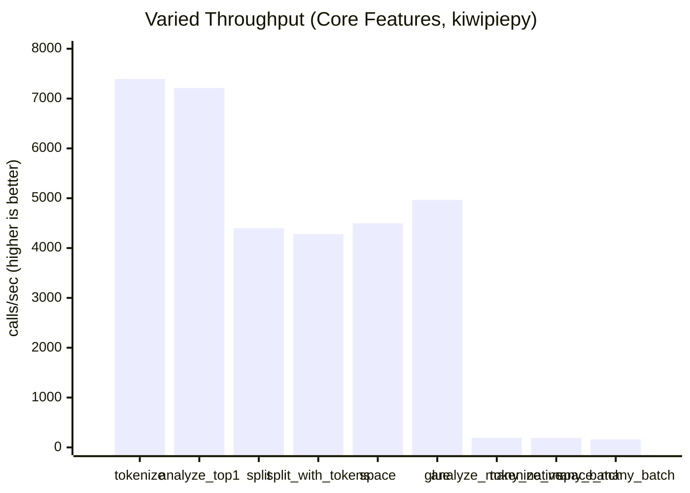
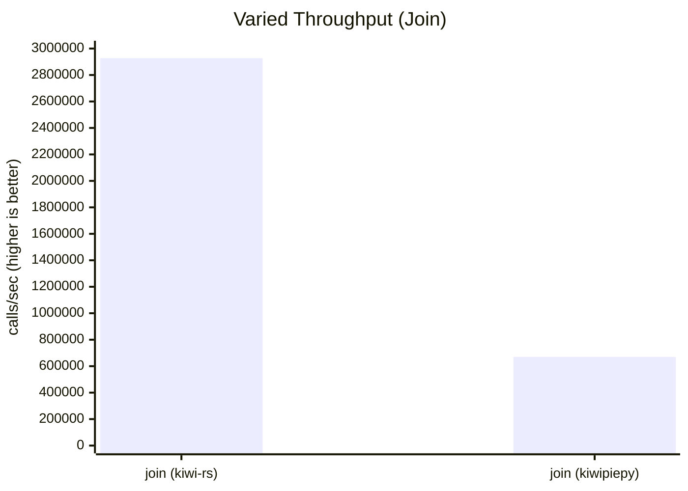
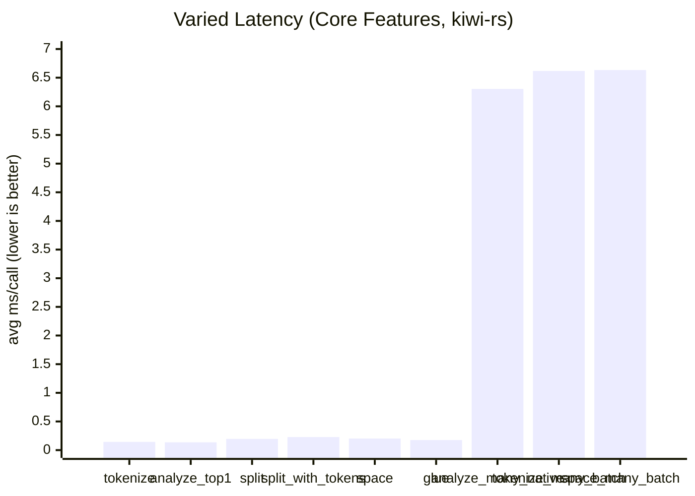
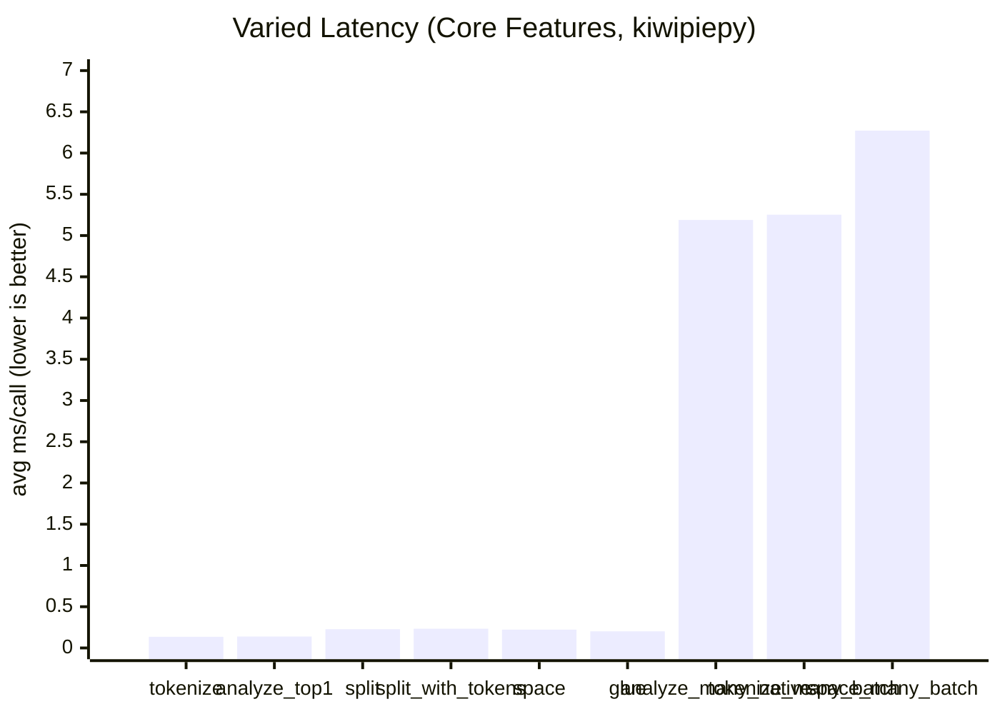

# kiwi-rs

[한국어 README](README.ko.md) | [kiwipiepy parity (EN)](docs/kiwipiepy_parity.md) | [kiwipiepy parity (KO)](docs/kiwipiepy_parity.ko.md)

Rust bindings for Kiwi via the official C API (`include/kiwi/capi.h`).

## AI user guide

If you use an AI assistant (Codex/ChatGPT/Claude/Gemini, etc.) to generate `kiwi-rs` code, ask for output with this contract:

1. Choose one init path only (`Kiwi::init`, `Kiwi::new`, or `Kiwi::from_config`) and explain why.
2. Return runnable Rust code (`fn main() -> Result<(), Box<dyn std::error::Error>>`).
3. Include one verification command (`cargo run --example ...` or `cargo run`).
4. List 2-3 request-specific pitfalls (not generic advice).

Prompt template:

```text
Use kiwi-rs and provide:
1) init path choice with reason,
2) copy-paste runnable Rust code,
3) one verification command,
4) pitfalls for this exact task.
Task: <describe your task here>
Environment: <OS / whether KIWI_LIBRARY_PATH and KIWI_MODEL_PATH are set>
```

Accuracy checks you should ask AI to follow:

- Treat UTF-8 offsets as character indices, not byte indices.
- Check `supports_utf16_api()` before UTF-16 APIs.
- Check `supports_analyze_mw()` before `analyze_many_utf16_via_native`.
- Do not assume full `kiwipiepy` parity (see `docs/kiwipiepy_parity.md`).

### Skill-based usage (`skills/`)

This repository includes a local AI skill for `kiwi-rs`:

- Skill file: `skills/kiwi-rs-assistant/SKILL.md`
- Reference docs: `skills/kiwi-rs-assistant/references/`
- Agent metadata: `skills/kiwi-rs-assistant/agents/openai.yaml`

If your assistant supports skill invocation, call it explicitly:

```text
Use $kiwi-rs-assistant and implement: <your task>
```

### `llms.txt` usage

Use `llms.txt` as the first context file when prompting AI. It summarizes the canonical docs, API surface, examples, and guardrails in one place.

- File: `llms.txt`
- Recommended prompt add-on:

```text
Read llms.txt first, then answer using repository APIs and examples only.
```

## Current support status

As of February 16, 2026:

- C API symbol loading: complete (`101/101` symbols in `capi.h` are loaded)
- Core high-level usage: implemented (`init/new/from_config`, `analyze/tokenize/split/join`, `MorphemeSet`, `Pretokenized`, typo APIs, `SwTokenizer`, CoNg APIs)
- kiwipiepy full surface parity: partial (Python/C++-specific layers still missing)

## Installation

```toml
[dependencies]
kiwi-rs = "0.1"
```

## Runtime setup options

### Option 1: automatic bootstrap in code

`Kiwi::init()` tries local paths first, then downloads a matching release pair (library + model) into cache.

```rust
use kiwi_rs::Kiwi;

fn main() -> Result<(), Box<dyn std::error::Error>> {
    let kiwi = Kiwi::init()?;
    let tokens = kiwi.tokenize("아버지가방에들어가신다.")?;
    println!("{}", tokens.len());
    Ok(())
}
```

Environment variables used by bootstrap:

- `KIWI_RS_VERSION` (default: `latest`, e.g. `v0.22.2`)
- `KIWI_RS_CACHE_DIR` (default: OS cache directory)

External commands required by bootstrap:

- Common: `curl`, `tar`
- Windows zip extraction: `powershell` (`Expand-Archive`)

### Option 2: helper installer scripts

Linux/macOS:

```bash
cd kiwi-rs
make install-kiwi
```

Windows (PowerShell):

```powershell
cd kiwi-rs
powershell -NoProfile -ExecutionPolicy Bypass -File .\scripts\install_kiwi.ps1
```

Installer options:

- `KIWI_VERSION` / `-Version` (default: `latest`)
- `KIWI_PREFIX` / `-Prefix` (default: `$HOME/.local/kiwi` on Unix, `%LOCALAPPDATA%\\kiwi` on Windows)
- `KIWI_MODEL_VARIANT` / `-ModelVariant` (default: `base`)

## Manual path configuration

### Env-based (`Kiwi::new`)

- `KIWI_LIBRARY_PATH`: dynamic library path
- `KIWI_MODEL_PATH`: model directory path

### Config-based (`Kiwi::from_config`)

```rust
use kiwi_rs::{Kiwi, KiwiConfig};

fn main() -> Result<(), Box<dyn std::error::Error>> {
    let config = KiwiConfig::default()
        .with_library_path("/path/to/libkiwi.dylib")
        .with_model_path("/path/to/models/cong/base")
        .add_user_word("러스트", "NNP", 0.0);

    let kiwi = Kiwi::from_config(config)?;
    let analyses = kiwi.analyze_top_n("형태소 분석 예시", 2)?;
    println!("{} candidates", analyses.len());
    Ok(())
}
```

## API overview

### Core

- Initialization: `Kiwi::init`, `Kiwi::new`, `Kiwi::from_config`, `Kiwi::init_direct`
- Analyze/tokenize: `analyze*`, `tokenize*`, `analyze_many*`, `tokenize_many*`
- Sentence split: `split_into_sents*`, `split_into_sents_with_options*`
- Join/spacing: `join*`, `space*`, `glue*`

### Advanced

- Builder: user words, alias words, pre-analyzed words, dictionary loading, regex rules, extract APIs
- Constraints: `MorphemeSet`, `Pretokenized`
- Typo: `KiwiTypo`, default typo sets, cost controls
- Subword: `SwTokenizer`
- CoNg: similarity/context/prediction/context-id conversion

### UTF-16 and optional API checks

- `Kiwi::supports_utf16_api`
- `Kiwi::supports_analyze_mw`
- `KiwiLibrary::supports_builder_init_stream`

## Supported APIs

### Kiwi

The main struct for analysis.

- **Initialization**: `init`, `init_with_version`, `new`, `from_config`, `init_direct`, `with_model_path`
- **Analysis**: `analyze`, `analyze_top_n`, `analyze_with_options`, `analyze_with_blocklist`, `analyze_with_pretokenized`, `analyze_with_blocklist_and_pretokenized`
- **Tokenization**: `tokenize`, `tokenize_with_match_options`, `tokenize_with_options`, `tokenize_with_blocklist`, `tokenize_with_pretokenized`, `tokenize_with_blocklist_and_pretokenized`
- **Multi-string Analysis**: `analyze_many_with_options`, `analyze_many_via_native`, `tokenize_many`, `tokenize_many_with_echo`
- **Sentence Splitting**: `split_into_sents`, `split_into_sents_with_options`
- **Spacing/Joining**: `space`, `space_many`, `glue`, `glue_with_options`, `join`, `prepare_join_morphs`, `prepare_join_tokens`, `prepare_joiner`, `join_prepared`, `join_prepared_utf16`
- **Configuration**:
    - `global_config`, `set_global_config`
    - `set_option`, `get_option`, `set_option_f`, `get_option_f`
    - `cutoff_threshold`, `set_cutoff_threshold`
    - `integrate_allomorph`, `set_integrate_allomorph`
    - `space_penalty`, `set_space_penalty`, `space_tolerance`, `set_space_tolerance`
    - `max_unk_form_size`, `set_max_unk_form_size`
    - `typo_cost_weight`, `set_typo_cost_weight`
- **Morpheme/Sense Info**: `morpheme`, `morpheme_info`, `morpheme_form`, `list_senses`, `tag_to_string`, `script_name`, `list_all_scripts`
- **Search**: `find_morphemes`, `find_morphemes_with_prefix`
- **Semantics (CoNg)**:
    - `most_similar_morphemes`, `most_similar_contexts`
    - `predict_words_from_context`, `predict_next_morpheme`
    - `predict_words_from_context_diff`, `predict_next_morpheme_diff`
    - `morpheme_similarity`, `context_similarity`
    - `to_context_id`, `from_context_id`
- **Sub-objects Creation**: `typo`, `basic_typo`, `default_typo_set`, `new_morphset`, `new_pretokenized`, `open_sw_tokenizer`
- **UTF-16**: `analyze_utf16*`, `tokenize_utf16*`, `split_into_sents_utf16*`, `join_utf16`, `analyze_many_utf16_via_native`
- **Misc**: `library_version`, `num_workers`, `model_type`, `typo_cost_threshold`, `add_re_word`, `clear_re_words`

### KiwiBuilder

Used to customize the dictionary and build a `Kiwi` instance.

- **Build**: `build`, `build_with_default_options`
- **Word Management**: `add_user_word`, `add_pre_analyzed_word`, `add_rule`, `add_re_rule`, `add_alias`, `add_automata`
- **Dictionary Loading**: `load_dictionary`, `load_user_dictionary`, `extract_add_words`
- **Configuration**: `set_option`, `get_option`, `set_option_f`, `get_option_f`, `set_cut_off_threshold`, `set_integrate_allomorph`, `set_model_path`

### KiwiTypo

Corrects typos in text.

- **Creation**: `Kiwi::typo`, `Kiwi::basic_typo`, `Kiwi::default_typo_set`
- **Management**: `add`, `update`, `scale_cost`, `set_continual_typo_cost`, `set_lengthening_typo_cost`, `copy`

### SwTokenizer

Subword tokenizer.

- **Usage**: `encode`, `encode_with_offsets`, `decode`

### MorphemeSet

A set of morphemes for blocklisting.

- **Management**: `add`, `add_utf16`

### Pretokenized

Defines pre-analyzed token spans.

- **Management**: `add_span`, `add_token_to_span`, `add_token_to_span_utf16`


## Examples

```bash
cd kiwi-rs
cargo run --example basic
cargo run --example analyze_options
cargo run --example builder_custom_words
cargo run --example typo_build
cargo run --example blocklist_and_pretokenized
cargo run --example split_sentences
cargo run --example utf16_api
cargo run --example native_batch
cargo run --example sw_tokenizer -- /path/to/tokenizer.json
cargo run --example morpheme_semantics
cargo run --release --example bench_tokenize -- --iters 1000 --warmup 100
cargo run --release --example bench_features -- --iters 5000 --warmup 100 --batch-size 256 --batch-iters 500
```

What each example is for:

| Example | What you learn | Key APIs | Notes |
|---|---|---|---|
| `basic` | End-to-end quick start (init + tokenize) | `Kiwi::init`, `Kiwi::tokenize` | Demonstrates cache bootstrap behavior when assets are missing. |
| `analyze_options` | How candidate analysis options change output | `AnalyzeOptions`, `Kiwi::analyze_with_options` | Shows `top_n`, `match_options`, and candidate probabilities. |
| `builder_custom_words` | Building a custom analyzer with user lexicon/rules | `KiwiLibrary::builder`, `add_user_words`, `add_re_rule` | Uses builder-time customization APIs. |
| `typo_build` | Enabling typo-aware analysis | `default_typo_set`, `build_with_typo_and_default_options` | Prints typo-related token metadata. |
| `blocklist_and_pretokenized` | Blocking specific morphemes and forcing token spans | `new_morphset`, `new_pretokenized`, `tokenize_with_blocklist_and_pretokenized` | Useful for domain constraints and deterministic spans. |
| `split_sentences` | Sentence segmentation with per-sentence token/sub-sentence structures | `split_into_sents_with_options` | Shows the `Sentence` return surface (`text/start/end/tokens/subs`). |
| `utf16_api` | UTF-16 analysis/tokenization/sentence split path | `supports_utf16_api`, `analyze_utf16*`, `tokenize_utf16*`, `split_into_sents_utf16*` | Includes runtime feature check for UTF-16 support. |
| `native_batch` | Native callback-based batch analysis route | `analyze_many_via_native`, `analyze_many_utf16_via_native` | Useful for higher-throughput multi-line processing. |
| `sw_tokenizer` | Subword tokenizer encode/decode flow | `open_sw_tokenizer`, `encode_with_offsets`, `decode` | Requires `tokenizer.json` path argument. |
| `morpheme_semantics` | Morpheme ID lookup and CoNg semantic utilities | `find_morphemes`, `morpheme`, `most_similar_morphemes`, `to_context_id` | Shows semantic APIs that operate on morpheme/context IDs. |
| `bench_tokenize` | Fair latency/throughput timing split by phase | `Kiwi::init`, `Kiwi::tokenize` | Prints `init`, first call, and steady-state tokenize metrics using the same text repeatedly. |
| `bench_features` | Expanded feature throughput/latency comparison (Rust side) | `tokenize`, `analyze_with_options`, `split_into_sents*`, `space*`, `join*`, `glue`, `analyze_many*`, `tokenize_many` | Pair with `scripts/bench_features_kiwipiepy.py` and `scripts/compare_feature_bench.py` for Rust vs Python comparison. |

## Rust vs Python benchmark (same conditions)

Use the same input text / warmup / iteration count for both sides:

```bash
cd kiwi-rs
cargo run --release --example bench_tokenize -- --text "아버지가방에들어가신다." --warmup 100 --iters 5000
python3 scripts/bench_kiwipiepy.py --text "아버지가방에들어가신다." --warmup 100 --iters 5000
```

Notes:

- Compare `bench_avg_ms`, `calls_per_sec`, and `tokens_per_sec` for steady-state speed.
- Compare `init_ms` and `first_tokenize_ms` separately; startup can dominate one-shot runs.
- Ensure both runtimes use the same Kiwi library/model assets (`KIWI_LIBRARY_PATH`, `KIWI_MODEL_PATH`) when strict 1:1 comparison is required.
- For option parity with `kiwipiepy` tokenize defaults, add `--python-default-options` on the Rust benchmark command.

### Expanded feature benchmark snapshot (local run, 2026-02-17)

Commands:

```bash
cd kiwi-rs
mkdir -p tmp
.venv-bench/bin/python scripts/compare_feature_bench.py \
  --text "아버지가방에들어가신다." \
  --warmup 100 --iters 5000 \
  --batch-size 256 --batch-iters 500 \
  --input-mode repeated --variant-pool 4096 \
  --repeats 1 \
  --md-out tmp/feature_bench_repeated.md \
  --json-out tmp/feature_bench_repeated.json

.venv-bench/bin/python scripts/compare_feature_bench.py \
  --text "아버지가방에들어가신다." \
  --warmup 100 --iters 5000 \
  --batch-size 256 --batch-iters 500 \
  --input-mode varied --variant-pool 8192 \
  --repeats 1 \
  --md-out tmp/feature_bench_varied.md \
  --json-out tmp/feature_bench_varied.json
```

Automated weekly run (same command) is configured in `.github/workflows/feature-benchmark.yml`.
Generated markdown/json snapshots now include benchmark environment and config metadata.

Summary below is the median of 1 run, with min-max in brackets (same value for single-run snapshots).

Benchmark environment:

| Item | Value |
|---|---|
| Timestamp (local) | 2026-02-17T17:10:06+09:00 |
| OS | Darwin 24.6.0 |
| Platform | macOS-15.7.4-arm64-arm-64bit-Mach-O |
| CPU | arm64 (CPU brand unavailable in sandbox) |
| Cores (physical/logical) | -/10 |
| Memory | 16.00 GiB (17179869184 bytes) |
| rustc | rustc 1.93.1 (01f6ddf75 2026-02-11) |
| cargo | cargo 1.93.1 (083ac5135 2025-12-15) |
| Python (harness) | 3.14.3 (main, Feb 3 2026, 15:32:20) [Clang 17.0.0 (clang-1700.6.3.2)] |
| Python (bench bin) | Python 3.14.3 (`.venv-bench/bin/python`) |
| kiwipiepy | 0.22.2 |
| Git | `753b8dc4d648d33b5ed6f163ba2ae3cb46397a7e` (`main`, dirty=True) |

Benchmark config:

| Item | Value |
|---|---|
| text | 아버지가방에들어가신다. |
| warmup | 100 |
| iters | 5000 |
| batch_size | 256 |
| batch_iters | 500 |
| input_mode | repeated |
| variant_pool | 4096 |
| repeats | 1 |
| join_lm_search | true |

Throughput comparison (`calls_per_sec`, higher is better):

| Feature | `kiwi-rs` | `kiwipiepy` | Relative (`kiwi-rs / kiwipiepy`) |
|---|---:|---:|---:|
| `tokenize` | 1185489.51 [1185489.51-1185489.51] | 7792.55 [7792.55-7792.55] | 152.13x |
| `analyze_top1` | 1199112.66 [1199112.66-1199112.66] | 7612.25 [7612.25-7612.25] | 157.52x |
| `split_into_sents` | 28908752.41 [28908752.41-28908752.41] | 3802.38 [3802.38-3802.38] | 7602.80x |
| `split_into_sents_with_tokens` | 250558.01 [250558.01-250558.01] | 4872.41 [4872.41-4872.41] | 51.42x |
| `space` | 357757.20 [357757.20-357757.20] | 4768.69 [4768.69-4768.69] | 75.02x |
| `join` | 2402355.08 [2402355.08-2402355.08] | 675759.32 [675759.32-675759.32] | 3.56x |
| `glue` | 6221490.02 [6221490.02-6221490.02] | 7613.64 [7613.64-7613.64] | 817.15x |
| `analyze_many_loop` | 32.36 [32.36-32.36] | 27.94 [27.94-27.94] | 1.16x |
| `analyze_many_native` | 166.11 [166.11-166.11] | 165.71 [165.71-165.71] | 1.00x |
| `tokenize_many_loop` | 3409.24 [3409.24-3409.24] | 28.66 [28.66-28.66] | 118.95x |
| `tokenize_many_batch` | 3134.67 [3134.67-3134.67] | 184.16 [184.16-184.16] | 17.02x |
| `split_many_loop` | 27.87 [27.87-27.87] | 29.18 [29.18-29.18] | 0.96x |
| `space_many_loop` | 29.39 [29.39-29.39] | 27.22 [27.22-27.22] | 1.08x |
| `space_many_batch` | 161.79 [161.79-161.79] | 160.39 [160.39-160.39] | 1.01x |
| `batch_analyze_native` | 166.11 [166.11-166.11] | 165.71 [165.71-165.71] | 1.00x |

Startup (`init_ms`, lower is better):

| Init path | `kiwi-rs` | `kiwipiepy` |
|---|---:|---:|
| `Kiwi::init()` / `Kiwi()` | 1417.905 [1417.905-1417.905] ms | 680.748 [680.748-680.748] ms |

Rust-only benchmark features:

| Feature | `kiwi-rs` |
|---|---:|
| `join_prepared` | 277556.12 [277556.12-277556.12] |
| `join_prepared_utf16` | 278618.79 [278618.79-278618.79] |
| `joiner_reuse` | 3518440.85 [3518440.85-3518440.85] |
| `joiner_reuse_utf16` | 2743359.29 [2743359.29-2743359.29] |

Python-only benchmark features:

| Feature | `kiwipiepy` |
|---|---:|
| `split_many_batch` | 181.50 [181.50-181.50] |

Varied-input (near no-cache) ratio snapshot (`input_mode=varied`, `variant_pool=8192`):

| Feature | Repeated Ratio | Repeated Δ% | Varied Ratio | Varied Δ% |
|---|---:|---:|---:|---:|
| `tokenize` | 152.13x | +15113.0% | 0.94x | -6.0% |
| `analyze_top1` | 157.52x | +15652.0% | 1.01x | +1.0% |
| `split_into_sents` | 7602.80x | +760180.0% | 1.16x | +16.0% |
| `split_into_sents_with_tokens` | 51.42x | +5042.0% | 1.02x | +2.0% |
| `glue` | 817.15x | +81615.0% | 1.15x | +15.0% |
| `analyze_many_native` | 1.00x | +0.0% | 0.82x | -18.0% |
| `tokenize_many_batch` | 17.02x | +1602.0% | 0.79x | -21.0% |
| `space_many_batch` | 1.01x | +1.0% | 0.95x | -5.0% |
| `join` | 3.56x | +256.0% | 4.37x | +337.0% |

`Δ%` is `(kiwi-rs / kiwipiepy - 1) * 100`.  
`+` means `kiwi-rs` is faster, `-` means slower.

Visual bar charts (relative throughput):







Absolute-value charts (varied input, near no-cache):

- Throughput = number of calls processed per second (`calls/sec`, higher is better)
- Latency = average time per call (`avg_ms`, lower is better)
- `mermaid xychart-beta` can visually overlap multi-bar series in some renderers.
- To keep readability, charts below are split by engine.











Side-by-side numeric comparison (varied input, near no-cache):

| Feature | `kiwi-rs` calls/sec | `kiwipiepy` calls/sec | Ratio (`x`) | Δ% | `kiwi-rs` avg_ms | `kiwipiepy` avg_ms |
|---|---:|---:|---:|---:|---:|---:|
| `tokenize` | 6956.95 | 7393.81 | 0.94x | -6.0% | 0.143741 | 0.135248 |
| `analyze_top1` | 7319.22 | 7212.44 | 1.01x | +1.0% | 0.136627 | 0.138649 |
| `split_into_sents` | 5104.73 | 4399.49 | 1.16x | +16.0% | 0.195897 | 0.227299 |
| `split_into_sents_with_tokens` | 4372.13 | 4282.95 | 1.02x | +2.0% | 0.228721 | 0.233484 |
| `space` | 4944.59 | 4497.21 | 1.10x | +10.0% | 0.202241 | 0.222360 |
| `glue` | 5692.86 | 4965.80 | 1.15x | +15.0% | 0.175659 | 0.201377 |
| `join` | 2927258.22 | 669983.08 | 4.37x | +337.0% | 0.000342 | 0.001493 |
| `analyze_many_native` | 158.62 | 192.74 | 0.82x | -18.0% | 6.304233 | 5.188234 |
| `tokenize_many_batch` | 151.12 | 190.38 | 0.79x | -21.0% | 6.617300 | 5.252784 |
| `space_many_batch` | 150.76 | 159.43 | 0.95x | -5.0% | 6.632977 | 6.272204 |

`Δ%` is `(kiwi-rs / kiwipiepy - 1) * 100`.

Interpretation:

- `join` is now faster on `kiwi-rs` for repeated identical morph sequences because the default `join` path reuses an internal LRU joiner cache.
- `split_into_sents` and `glue` are now above 1.0x even in the `varied` scenario after reducing miss-path cache overhead and reusing glue pair decisions.
- `prepare_joiner` (`joiner_reuse*`) remains the fastest path when explicitly reusing a fixed morph sequence.
- Repeated identical inputs show large gains on `tokenize*`, `analyze*`, and tokenized sentence split paths because internal result caches are reused.
- For strict fairness, publish both scenarios together: `input_mode=repeated` (warm-cache) and `input_mode=varied` (near no-cache).
- `split_many_batch` is still Python-only in this benchmark set.
- `Kiwi::init()` includes runtime asset discovery/bootstrap checks, so startup should be evaluated separately from steady-state throughput.

## kiwipiepy parity

Detailed matrix:

- English: `docs/kiwipiepy_parity.md`
- Korean: `docs/kiwipiepy_parity.ko.md`

In short, `kiwi-rs` already covers most C API-backed workflows, while Python/C++-specific layers (template/dataset/ngram utilities) remain out of scope for a pure C API binding.

## Common errors

- `failed to load library`
  - Library path is invalid or inaccessible. Set `KIWI_LIBRARY_PATH` explicitly or use `Kiwi::init()`.

- `Cannot open extract.mdl for WordDetector`
  - Model path is wrong. Point `KIWI_MODEL_PATH` (or config model path) to the directory containing model files.

- `reading type 'Ds' failed` (iostream-style errors)
  - Library/model version mismatch. Use matching assets from the same Kiwi release tag.

## Local quality checks

```bash
cd kiwi-rs
cargo fmt
cargo check
cargo test
cargo clippy --all-targets -- -D warnings
cargo check --examples
cargo package --allow-dirty
```

## License

- `kiwi-rs` is licensed under **LGPL-2.1-or-later**.
- The upstream Kiwi C library used by this project is distributed under LGPL 2.1 terms.
- See [`LICENSE`](LICENSE) for the full license text.
