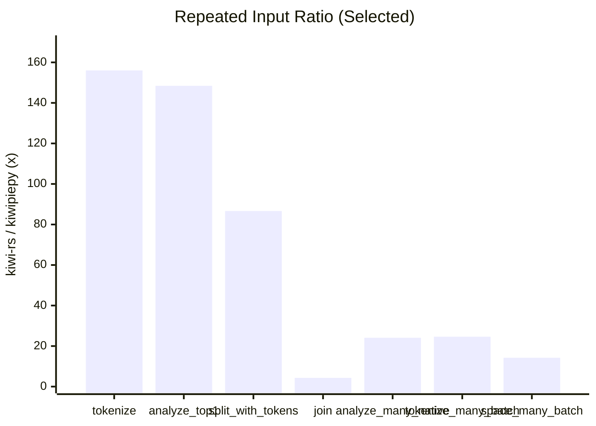
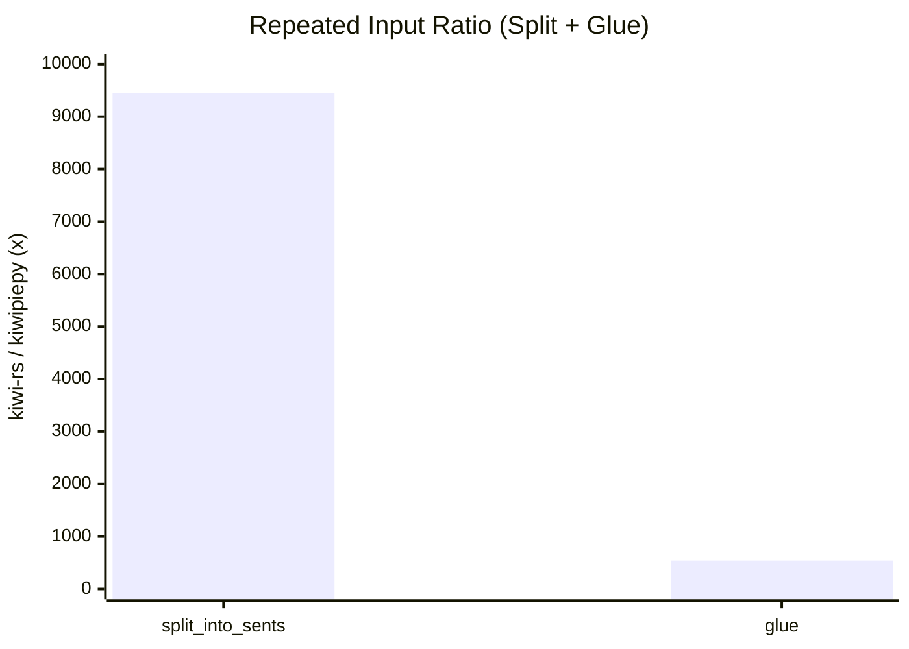
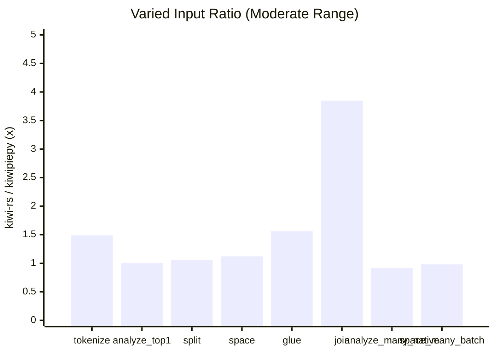
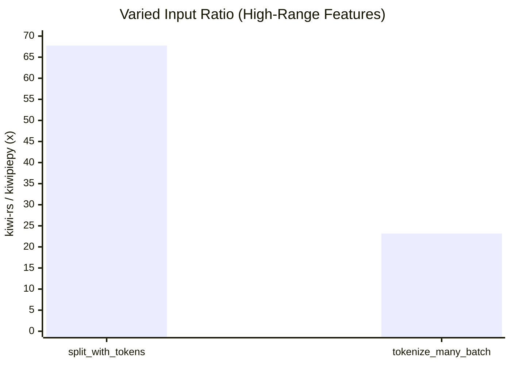

# kiwi-rs

[Technical Report (PDF)](report/technical_report.pdf) | [한국어 README](README.ko.md) | [kiwipiepy parity (EN)](docs/kiwipiepy_parity.md) | [kiwipiepy parity (KO)](docs/kiwipiepy_parity.ko.md)

Rust bindings for Kiwi via the official C API (`include/kiwi/capi.h`).

## Table of contents

- [AI user guide](#ai-user-guide)
- [Current support status](#current-support-status)
- [Installation](#installation)
- [Runtime setup options](#runtime-setup-options)
- [Manual path configuration](#manual-path-configuration)
- [API overview](#api-overview)
- [Supported APIs](#supported-apis)
- [Examples](#examples)
- [Rust vs Python benchmark (same conditions)](#rust-vs-python-benchmark-same-conditions)
- [kiwipiepy parity](#kiwipiepy-parity)
- [Common errors](#common-errors)
- [Local quality checks](#local-quality-checks)
- [License](#license)

## AI user guide

If you use an AI assistant (Codex/ChatGPT/Claude/Gemini, etc.) to generate `kiwi-rs` code, ask for output with this contract:

1. Choose one init path only (`Kiwi::init`, `Kiwi::new`, or `Kiwi::from_config`) and explain why.
2. Return runnable Rust code (`fn main() -> Result<(), Box<dyn std::error::Error>>`).
3. Include one verification command (`cargo run --example ...` or `cargo run`).
4. List 2-3 request-specific pitfalls (not generic advice).

Prompt template:

```text
Use kiwi-rs and provide:
1) init path choice with reason,
2) copy-paste runnable Rust code,
3) one verification command,
4) pitfalls for this exact task.
Task: <describe your task here>
Environment: <OS / whether KIWI_LIBRARY_PATH and KIWI_MODEL_PATH are set>
```

Accuracy checks you should ask AI to follow:

- Treat UTF-8 offsets as character indices, not byte indices.
- Check `supports_utf16_api()` before UTF-16 APIs.
- Check `supports_analyze_mw()` before `analyze_many_utf16_via_native`.
- Do not assume full `kiwipiepy` parity (see `docs/kiwipiepy_parity.md`).

### Skill-based usage (`skills/`)

This repository includes a local AI skill for `kiwi-rs`:

- Skill file: `skills/kiwi-rs-assistant/SKILL.md`
- Reference docs: `skills/kiwi-rs-assistant/references/`
- Agent metadata: `skills/kiwi-rs-assistant/agents/openai.yaml`

If your assistant supports skill invocation, call it explicitly:

```text
Use $kiwi-rs-assistant and implement: <your task>
```

### `llms.txt` usage

Use `llms.txt` as the first context file when prompting AI. It summarizes the canonical docs, API surface, examples, and guardrails in one place.

- File: `llms.txt`
- Recommended prompt add-on:

```text
Read llms.txt first, then answer using repository APIs and examples only.
```

## Current support status

As of February 16, 2026:

- C API symbol loading: complete (`101/101` symbols in `capi.h` are loaded)
- Core high-level usage: implemented (`init/new/from_config`, `analyze/tokenize/split/join`, `MorphemeSet`, `Pretokenized`, typo APIs, `SwTokenizer`, CoNg APIs)
- kiwipiepy full surface parity: partial (Python/C++-specific layers still missing)

## Installation

```toml
[dependencies]
kiwi-rs = "0.1"
```

## Runtime setup options

### Option 1: automatic bootstrap in code

`Kiwi::init()` tries local paths first, then downloads a matching release pair (library + model) into cache.

```rust
use kiwi_rs::Kiwi;

fn main() -> Result<(), Box<dyn std::error::Error>> {
    let kiwi = Kiwi::init()?;
    let tokens = kiwi.tokenize("아버지가방에들어가신다.")?;
    println!("{}", tokens.len());
    Ok(())
}
```

Environment variables used by bootstrap:

- `KIWI_RS_VERSION` (default: `latest`, e.g. `v0.22.2`)
- `KIWI_RS_CACHE_DIR` (default: OS cache directory)

External commands required by bootstrap:

- Common: `curl`, `tar`
- Windows zip extraction: `powershell` (`Expand-Archive`)

### Option 2: helper installer scripts

Linux/macOS:

```bash
cd kiwi-rs
make install-kiwi
```

Windows (PowerShell):

```powershell
cd kiwi-rs
powershell -NoProfile -ExecutionPolicy Bypass -File .\scripts\install_kiwi.ps1
```

Installer options:

- `KIWI_VERSION` / `-Version` (default: `latest`)
- `KIWI_PREFIX` / `-Prefix` (default: `$HOME/.local/kiwi` on Unix, `%LOCALAPPDATA%\\kiwi` on Windows)
- `KIWI_MODEL_VARIANT` / `-ModelVariant` (default: `base`)

## Manual path configuration

### Env-based (`Kiwi::new`)

- `KIWI_LIBRARY_PATH`: dynamic library path
- `KIWI_MODEL_PATH`: model directory path

### Config-based (`Kiwi::from_config`)

```rust
use kiwi_rs::{Kiwi, KiwiConfig};

fn main() -> Result<(), Box<dyn std::error::Error>> {
    let config = KiwiConfig::default()
        .with_library_path("/path/to/libkiwi.dylib")
        .with_model_path("/path/to/models/cong/base")
        .add_user_word("러스트", "NNP", 0.0);

    let kiwi = Kiwi::from_config(config)?;
    let analyses = kiwi.analyze_top_n("형태소 분석 예시", 2)?;
    println!("{} candidates", analyses.len());
    Ok(())
}
```

## API overview

### Core

- Initialization: `Kiwi::init`, `Kiwi::new`, `Kiwi::from_config`, `Kiwi::init_direct`
- Analyze/tokenize: `analyze*`, `tokenize*`, `analyze_many*`, `tokenize_many*`
- Sentence split: `split_into_sents*`, `split_into_sents_with_options*`
- Join/spacing: `join*`, `space*`, `glue*`

### Advanced

- Builder: user words, alias words, pre-analyzed words, dictionary loading, regex rules, extract APIs
- Constraints: `MorphemeSet`, `Pretokenized`
- Typo: `KiwiTypo`, default typo sets, cost controls
- Subword: `SwTokenizer`
- CoNg: similarity/context/prediction/context-id conversion

### UTF-16 and optional API checks

- `Kiwi::supports_utf16_api`
- `Kiwi::supports_analyze_mw`
- `KiwiLibrary::supports_builder_init_stream`

## Supported APIs

### Kiwi

The main struct for analysis.

- **Initialization**: `init`, `init_with_version`, `new`, `from_config`, `init_direct`, `with_model_path`
- **Analysis**: `analyze`, `analyze_top_n`, `analyze_with_options`, `analyze_with_blocklist`, `analyze_with_pretokenized`, `analyze_with_blocklist_and_pretokenized`
- **Tokenization**: `tokenize`, `tokenize_with_match_options`, `tokenize_with_options`, `tokenize_with_blocklist`, `tokenize_with_pretokenized`, `tokenize_with_blocklist_and_pretokenized`
- **Multi-string Analysis**: `analyze_many_with_options`, `analyze_many_via_native`, `tokenize_many`, `tokenize_many_with_echo`
- **Sentence Splitting**: `split_into_sents`, `split_into_sents_with_options`
- **Spacing/Joining**: `space`, `space_many`, `glue`, `glue_with_options`, `join`, `prepare_join_morphs`, `prepare_join_tokens`, `prepare_joiner`, `join_prepared`, `join_prepared_utf16`
- **Configuration**:
    - `global_config`, `set_global_config`
    - `set_option`, `get_option`, `set_option_f`, `get_option_f`
    - `cutoff_threshold`, `set_cutoff_threshold`
    - `integrate_allomorph`, `set_integrate_allomorph`
    - `space_penalty`, `set_space_penalty`, `space_tolerance`, `set_space_tolerance`
    - `max_unk_form_size`, `set_max_unk_form_size`
    - `typo_cost_weight`, `set_typo_cost_weight`
- **Morpheme/Sense Info**: `morpheme`, `morpheme_info`, `morpheme_form`, `list_senses`, `tag_to_string`, `script_name`, `list_all_scripts`
- **Search**: `find_morphemes`, `find_morphemes_with_prefix`
- **Semantics (CoNg)**:
    - `most_similar_morphemes`, `most_similar_contexts`
    - `predict_words_from_context`, `predict_next_morpheme`
    - `predict_words_from_context_diff`, `predict_next_morpheme_diff`
    - `morpheme_similarity`, `context_similarity`
    - `to_context_id`, `from_context_id`
- **Sub-objects Creation**: `typo`, `basic_typo`, `default_typo_set`, `new_morphset`, `new_pretokenized`, `open_sw_tokenizer`
- **UTF-16**: `analyze_utf16*`, `tokenize_utf16*`, `split_into_sents_utf16*`, `join_utf16`, `analyze_many_utf16_via_native`
- **Misc**: `library_version`, `num_workers`, `model_type`, `typo_cost_threshold`, `add_re_word`, `clear_re_words`

### KiwiBuilder

Used to customize the dictionary and build a `Kiwi` instance.

- **Build**: `build`, `build_with_default_options`
- **Word Management**: `add_user_word`, `add_pre_analyzed_word`, `add_rule`, `add_re_rule`, `add_alias`, `add_automata`
- **Dictionary Loading**: `load_dictionary`, `load_user_dictionary`, `extract_add_words`
- **Configuration**: `set_option`, `get_option`, `set_option_f`, `get_option_f`, `set_cut_off_threshold`, `set_integrate_allomorph`, `set_model_path`

### KiwiTypo

Corrects typos in text.

- **Creation**: `Kiwi::typo`, `Kiwi::basic_typo`, `Kiwi::default_typo_set`
- **Management**: `add`, `update`, `scale_cost`, `set_continual_typo_cost`, `set_lengthening_typo_cost`, `copy`

### SwTokenizer

Subword tokenizer.

- **Usage**: `encode`, `encode_with_offsets`, `decode`

### MorphemeSet

A set of morphemes for blocklisting.

- **Management**: `add`, `add_utf16`

### Pretokenized

Defines pre-analyzed token spans.

- **Management**: `add_span`, `add_token_to_span`, `add_token_to_span_utf16`


## Examples

```bash
cd kiwi-rs
cargo run --example basic
cargo run --example analyze_options
cargo run --example builder_custom_words
cargo run --example typo_build
cargo run --example blocklist_and_pretokenized
cargo run --example split_sentences
cargo run --example utf16_api
cargo run --example native_batch
cargo run --example sw_tokenizer -- /path/to/tokenizer.json
cargo run --example morpheme_semantics
cargo run --release --example bench_tokenize -- --iters 1000 --warmup 100
cargo run --release --example bench_features -- --iters 5000 --warmup 100 --batch-size 256 --batch-iters 500
```

What each example is for:

| Example | What you learn | Key APIs | Notes |
|---|---|---|---|
| `basic` | End-to-end quick start (init + tokenize) | `Kiwi::init`, `Kiwi::tokenize` | Demonstrates cache bootstrap behavior when assets are missing. |
| `analyze_options` | How candidate analysis options change output | `AnalyzeOptions`, `Kiwi::analyze_with_options` | Shows `top_n`, `match_options`, and candidate probabilities. |
| `builder_custom_words` | Building a custom analyzer with user lexicon/rules | `KiwiLibrary::builder`, `add_user_words`, `add_re_rule` | Uses builder-time customization APIs. |
| `typo_build` | Enabling typo-aware analysis | `default_typo_set`, `build_with_typo_and_default_options` | Prints typo-related token metadata. |
| `blocklist_and_pretokenized` | Blocking specific morphemes and forcing token spans | `new_morphset`, `new_pretokenized`, `tokenize_with_blocklist_and_pretokenized` | Useful for domain constraints and deterministic spans. |
| `split_sentences` | Sentence segmentation with per-sentence token/sub-sentence structures | `split_into_sents_with_options` | Shows the `Sentence` return surface (`text/start/end/tokens/subs`). |
| `utf16_api` | UTF-16 analysis/tokenization/sentence split path | `supports_utf16_api`, `analyze_utf16*`, `tokenize_utf16*`, `split_into_sents_utf16*` | Includes runtime feature check for UTF-16 support. |
| `native_batch` | Native callback-based batch analysis route | `analyze_many_via_native`, `analyze_many_utf16_via_native` | Useful for higher-throughput multi-line processing. |
| `sw_tokenizer` | Subword tokenizer encode/decode flow | `open_sw_tokenizer`, `encode_with_offsets`, `decode` | Requires `tokenizer.json` path argument. |
| `morpheme_semantics` | Morpheme ID lookup and CoNg semantic utilities | `find_morphemes`, `morpheme`, `most_similar_morphemes`, `to_context_id` | Shows semantic APIs that operate on morpheme/context IDs. |
| `bench_tokenize` | Fair latency/throughput timing split by phase | `Kiwi::init`, `Kiwi::tokenize` | Prints `init`, first call, and steady-state tokenize metrics using the same text repeatedly. |
| `bench_features` | Expanded feature throughput/latency comparison (Rust side) | `tokenize`, `analyze_with_options`, `split_into_sents*`, `space*`, `join*`, `glue`, `analyze_many*`, `tokenize_many` | Pair with `scripts/bench_features_kiwipiepy.py` and `scripts/compare_feature_bench.py` for Rust vs Python comparison. |

## Rust vs Python benchmark (same conditions)

Use the same input text / warmup / iteration count for both sides:

```bash
cd kiwi-rs
cargo run --release --example bench_tokenize -- --text "아버지가방에들어가신다." --warmup 100 --iters 5000
python3 scripts/bench_kiwipiepy.py --text "아버지가방에들어가신다." --warmup 100 --iters 5000
```

Notes:

- Compare `bench_avg_ms`, `calls_per_sec`, and `tokens_per_sec` for steady-state speed.
- Compare `init_ms` and `first_tokenize_ms` separately; startup can dominate one-shot runs.
- Ensure both runtimes use the same Kiwi library/model assets (`KIWI_LIBRARY_PATH`, `KIWI_MODEL_PATH`) when strict 1:1 comparison is required.
- For option parity with `kiwipiepy` tokenize defaults, add `--python-default-options` on the Rust benchmark command.

### Publication-grade benchmark run (recommended)

Use this command set when you publish benchmark claims externally:

```bash
cd kiwi-rs
mkdir -p tmp
.venv-bench/bin/python scripts/compare_feature_bench.py \
  --text "아버지가방에들어가신다." \
  --warmup 100 --iters 5000 \
  --batch-size 256 --batch-iters 500 \
  --input-mode repeated --variant-pool 4096 \
  --repeats 7 \
  --engine-order alternate \
  --sleep-between-engines-ms 200 \
  --sleep-between-runs-ms 500 \
  --sink-warning-threshold 0.05 \
  --bootstrap-samples 2000 \
  --equivalence-band 0.05 \
  --strict-sink-check \
  --md-out tmp/feature_bench_repeated_r7.md \
  --json-out tmp/feature_bench_repeated_r7.json

.venv-bench/bin/python scripts/compare_feature_bench.py \
  --text "아버지가방에들어가신다." \
  --warmup 100 --iters 5000 \
  --batch-size 256 --batch-iters 500 \
  --input-mode varied --variant-pool 8192 \
  --repeats 7 \
  --engine-order alternate \
  --sleep-between-engines-ms 200 \
  --sleep-between-runs-ms 500 \
  --sink-warning-threshold 0.05 \
  --bootstrap-samples 2000 \
  --equivalence-band 0.05 \
  --strict-sink-check \
  --md-out tmp/feature_bench_varied_r7.md \
  --json-out tmp/feature_bench_varied_r7.json
```

Credibility checklist:

- Publish both `input_mode=repeated` (warm-cache) and `input_mode=varied` (near no-cache).
- Keep Rust in release mode and report the exact commands (`rust_cmd`, `python_cmd`) from metadata.
- Keep assets aligned (`KIWI_LIBRARY_PATH`, `KIWI_MODEL_PATH`) and include them in the report metadata.
- Use at least `repeats>=5` (recommended `7`) and report variability (`CV`, `p95`, min-max).
- Add statistical defensibility with ratio `95% bootstrap CI` and `P(ratio>1)`.
- Review the workload parity table (`sink` ratio). Use `--strict-sink-check` in CI if you need hard guardrails.
- Publish Git SHA + dirty status so readers can reproduce exactly.

SWE metric interpretation (for strict reviewers):

- Throughput winner claim should use CI, not just point ratio: report as `ratio [low, high]`.
- If CI is fully above `1.05`, treat as robust Rust win under ±5% practical equivalence.
- If CI crosses `[0.95, 1.05]`, report as equivalent/inconclusive instead of forcing a winner.
- Keep startup (`init_ms`) independent from steady-state throughput conclusions.

Dataset-driven benchmark (recommended for external review):

```bash
cd kiwi-rs
mkdir -p tmp
.venv-bench/bin/python scripts/compare_feature_bench.py \
  --dataset-tsv benchmarks/datasets/swe_textset_v2.tsv \
  --input-mode varied \
  --warmup 20 --iters 300 \
  --batch-size 128 --batch-iters 60 \
  --repeats 5 \
  --engine-order alternate \
  --sleep-between-engines-ms 100 \
  --sleep-between-runs-ms 200 \
  --sink-warning-threshold 0.05 \
  --bootstrap-samples 2000 \
  --equivalence-band 0.05 \
  --strict-sink-check \
  --md-out tmp/feature_bench_dataset_v2.md \
  --json-out tmp/feature_bench_dataset_v2.json

.venv-bench/bin/python scripts/compare_feature_dataset.py \
  --dataset-tsv benchmarks/datasets/swe_textset_v2.tsv \
  --input-mode varied \
  --warmup 20 --iters 300 \
  --batch-size 128 --batch-iters 60 \
  --repeats 5 \
  --out-dir tmp/feature_dataset_matrix_v2
```

Dataset references:

- Spec: `docs/benchmark_dataset_spec.md`
- Defense guide: `docs/benchmark_defense.md`

### Expanded feature benchmark snapshot (dataset v2, multi-run, 2026-02-17)

Review-defense reference:

- `docs/benchmark_defense.md`
- `tmp/feature_dataset_matrix_v2_varied_r5_i300/matrix_summary.md`

Commands used for this snapshot:

```bash
cd kiwi-rs
mkdir -p tmp

# warm-cache overall (repeated input)
.venv-bench/bin/python scripts/compare_feature_bench.py \
  --dataset-tsv benchmarks/datasets/swe_textset_v2.tsv \
  --input-mode repeated \
  --warmup 20 --iters 300 \
  --batch-size 128 --batch-iters 60 \
  --repeats 5 \
  --engine-order alternate \
  --sleep-between-engines-ms 100 \
  --sleep-between-runs-ms 200 \
  --bootstrap-samples 2000 \
  --equivalence-band 0.05 \
  --strict-sink-check \
  --md-out tmp/feature_dataset_matrix_v2_repeated_r5_i300/overall.md \
  --json-out tmp/feature_dataset_matrix_v2_repeated_r5_i300/overall.json

# near no-cache dataset-stratified matrix
.venv-bench/bin/python scripts/compare_feature_dataset.py \
  --dataset-tsv benchmarks/datasets/swe_textset_v2.tsv \
  --input-mode varied \
  --warmup 20 --iters 300 \
  --batch-size 128 --batch-iters 60 \
  --repeats 5 \
  --bootstrap-samples 2000 \
  --equivalence-band 0.05 \
  --engine-order alternate \
  --sleep-between-engines-ms 100 \
  --sleep-between-runs-ms 200 \
  --out-dir tmp/feature_dataset_matrix_v2_varied_r5_i300
```

Artifacts:

- repeated overall: `tmp/feature_dataset_matrix_v2_repeated_r5_i300/overall.md`
- repeated overall json: `tmp/feature_dataset_matrix_v2_repeated_r5_i300/overall.json`
- varied overall: `tmp/feature_dataset_matrix_v2_varied_r5_i300/overall.md`
- varied overall json: `tmp/feature_dataset_matrix_v2_varied_r5_i300/overall.json`
- varied category matrix: `tmp/feature_dataset_matrix_v2_varied_r5_i300/matrix_summary.md`

Benchmark environment:

| Item | Value |
|---|---|
| Timestamp (local, varied overall) | `<LOCAL_TIMESTAMP_REDACTED>` |
| OS | `<HOST_OS_REDACTED>` |
| Platform | `<HOST_PLATFORM_REDACTED>` |
| CPU | `<HOST_CPU_REDACTED>` |
| Cores (physical/logical) | `<HOST_CORES_REDACTED>` |
| Memory | `<HOST_MEMORY_REDACTED>` |
| rustc | rustc 1.93.1 (01f6ddf75 2026-02-11) |
| cargo | cargo 1.93.1 (083ac5135 2025-12-15) |
| Python (harness) | 3.14.3 (`<BUILD_DETAILS_REDACTED>`) |
| Python (bench bin) | Python 3.14.3 (`.venv-bench/bin/python`) |
| kiwipiepy | 0.22.2 |
| Git | `<REPO_COMMIT_SHA>` (`<BRANCH>`, dirty=`<true\|false>`) |

Dataset profile:

| Item | Value |
|---|---|
| path | `benchmarks/datasets/swe_textset_v2.tsv` |
| sha256 | `8c81b8e8d0c4272f96c05e6851da10759f02361caa0a2acb881dd72e642f4696` |
| rows | 192 |
| unique texts | 192 |
| categories | 8 |
| category counts | code_mixed:24, colloquial:24, ecommerce:24, finance:24, longform:24, news:24, tech:24, typo_noisy:24 |
| text length (char) | min=14, median=63, max=192 |

Benchmark config:

| Profile | input_mode | warmup | iters | batch_size | batch_iters | repeats | bootstrap_samples | equivalence_band | engine_order |
|---|---|---:|---:|---:|---:|---:|---:|---:|---|
| repeated overall | repeated | 20 | 300 | 128 | 60 | 5 | 2000 | ±5% | alternate |
| varied matrix | varied | 20 | 300 | 128 | 60 | 5 | 2000 | ±5% | alternate |

Category summary (varied, per-category):

| Category | Median Ratio | Rust Wins / Total | Worst Feature | Best Feature |
|---|---:|---:|---|---|
| `code_mixed` | 40.23x | 15/15 | `join` (4.29x) | `split_many_loop` (3961.64x) |
| `colloquial` | 53.59x | 15/15 | `join` (3.98x) | `split_many_loop` (4633.05x) |
| `ecommerce` | 53.79x | 15/15 | `join` (4.27x) | `split_many_loop` (6435.18x) |
| `finance` | 49.18x | 15/15 | `join` (3.62x) | `split_many_loop` (7399.29x) |
| `longform` | 56.26x | 15/15 | `join` (4.70x) | `split_many_loop` (18218.50x) |
| `news` | 53.04x | 15/15 | `join` (3.66x) | `split_many_loop` (7721.17x) |
| `tech` | 43.72x | 15/15 | `join` (3.12x) | `split_many_loop` (6182.83x) |
| `typo_noisy` | 70.02x | 15/15 | `join` (3.97x) | `split_many_loop` (4048.25x) |

Repeated vs varied ratio snapshot (`kiwi-rs / kiwipiepy`):

| Feature | Repeated Ratio | Repeated Δ% | Varied Ratio | Varied Δ% |
|---|---:|---:|---:|---:|
| `tokenize` | 156.03x | +15503.4% | 1.49x | +48.9% |
| `analyze_top1` | 148.44x | +14744.4% | 1.00x | +0.3% |
| `split_into_sents` | 9445.91x | +944491.2% | 1.06x | +6.4% |
| `split_into_sents_with_tokens` | 86.64x | +8564.1% | 67.75x | +6675.4% |
| `space` | 99.02x | +9802.0% | 1.12x | +11.8% |
| `glue` | 542.54x | +54153.8% | 1.56x | +56.2% |
| `join` | 4.30x | +329.9% | 3.85x | +285.1% |
| `analyze_many_native` | 24.10x | +2309.9% | 0.92x | -7.9% |
| `tokenize_many_batch` | 24.62x | +2362.2% | 23.18x | +2217.9% |
| `space_many_batch` | 14.23x | +1322.6% | 0.98x | -1.7% |

`Δ%` is `(kiwi-rs / kiwipiepy - 1) * 100`.  
`+` means `kiwi-rs` is faster, `-` means slower.

Visual bar charts (relative throughput):









Throughput = calls processed per second (`calls/sec`, higher is better).
Latency = average time per call (`avg_ms`, lower is better).

Side-by-side numeric comparison (varied, near no-cache):

| Feature | `kiwi-rs` calls/sec | `kiwipiepy` calls/sec | Ratio (`x`) | Δ% | `kiwi-rs` avg_ms | `kiwipiepy` avg_ms |
|---|---:|---:|---:|---:|---:|---:|
| `tokenize` | 3052.78 | 2049.71 | 1.49x | +48.9% | 0.327571 | 0.487874 |
| `analyze_top1` | 2098.51 | 2092.15 | 1.00x | +0.3% | 0.476528 | 0.477976 |
| `split_into_sents` | 2116.51 | 1990.01 | 1.06x | +6.4% | 0.472477 | 0.502509 |
| `split_into_sents_with_tokens` | 137646.25 | 2031.56 | 67.75x | +6675.4% | 0.007265 | 0.492232 |
| `space` | 2420.12 | 2164.93 | 1.12x | +11.8% | 0.413203 | 0.461909 |
| `glue` | 2860.79 | 1831.72 | 1.56x | +56.2% | 0.349553 | 0.545935 |
| `join` | 1413427.56 | 367047.46 | 3.85x | +285.1% | 0.000708 | 0.002724 |
| `analyze_many_native` | 86.50 | 93.90 | 0.92x | -7.9% | 11.561290 | 10.650051 |
| `tokenize_many_batch` | 2259.52 | 97.48 | 23.18x | +2217.9% | 0.442572 | 10.258036 |
| `space_many_batch` | 92.02 | 93.64 | 0.98x | -1.7% | 10.867520 | 10.678922 |

Startup (`init_ms`, lower is better):

| Profile | `kiwi-rs` | `kiwipiepy` |
|---|---:|---:|
| repeated overall | 1316.395 ms | 631.000 ms |
| varied overall | 1326.721 ms | 622.918 ms |

Interpretation:

- Repeated identical input remains the warm-cache upper bound and shows large speedups for most features.
- Varied dataset input is the publication baseline for near no-cache behavior.
- In the varied profile, `analyze_many_native` and `space_many_batch` are close to parity and can still trail Python.
- `join` stays consistently faster in both profiles after join-path optimizations.
- Category-stratified varied results show `kiwi-rs` wins all common features (`15/15`) in all 8 categories.
- Keep startup (`init_ms`) separate from steady-state throughput conclusions.

## kiwipiepy parity

Detailed matrix:

- English: `docs/kiwipiepy_parity.md`
- Korean: `docs/kiwipiepy_parity.ko.md`

In short, `kiwi-rs` already covers most C API-backed workflows, while Python/C++-specific layers (template/dataset/ngram utilities) remain out of scope for a pure C API binding.

## Common errors

- `failed to load library`
  - Library path is invalid or inaccessible. Set `KIWI_LIBRARY_PATH` explicitly or use `Kiwi::init()`.

- `Cannot open extract.mdl for WordDetector`
  - Model path is wrong. Point `KIWI_MODEL_PATH` (or config model path) to the directory containing model files.

- `reading type 'Ds' failed` (iostream-style errors)
  - Library/model version mismatch. Use matching assets from the same Kiwi release tag.

## Local quality checks

```bash
cd kiwi-rs
cargo fmt
cargo check
cargo test
cargo clippy --all-targets -- -D warnings
cargo check --examples
cargo package --allow-dirty
```

## License

- `kiwi-rs` is licensed under **LGPL-2.1-or-later**.
- The upstream Kiwi C library used by this project is distributed under LGPL 2.1 terms.
- See [`LICENSE`](LICENSE) for the full license text.
